# Mapbox with React

In this project, we will learn how to use layers to display demographic data in Mapbox. We will build a basic React app using Vite. Then we will bring a Mapbox map into our React app. We will use QGIS to open shapefiles and export GeoJSON layers. We'll learn how to add the GeoJSON sources and display them as line and symbol layers in Mapbox. Then we will add an interaction layer, allowing the user to select areas from a dropdown and filtering the layers based on the user's choices. Then we'll use Python to manipulate socio-demographic data and generate GeoJSON files. We'll learn how to display a fill layer using varying colors and opacities to display different ethnic groups and population levels. Finally, we'll learn how to create a popup to display more specific information.

This project is based on Mapbox's tutorial on [using checkboxes to toggle layers in a React app](https://docs.mapbox.com/help/tutorials/react-toggle-layers/?step=0).

[See a working example](https://utsa-lib-cedish.github.io/mapbox-layers/).

## Table of Contents
- [Start a React Project](#start-a-react-project)
- [Get React Working](#get-react-working)
- [Create App and Map Components](#create-app-and-map-components)
  - [The App Component](#the-app-component)
  - [The Mapbox Token](#the-mapbox-token)
  - [The Map Component](#the-map-component)
  - [Give the Map Width and Height](#give-the-map-width-and-height)
  - [Render the Map](#render-the-map)
  - [Configuration Basics](#configuration-basics)
- [Adding Data](#adding-data)
  - [Mexican State and Municipal Boundaries](#mexican-state-and-municipal-boundaries)
  - [Adding Layers in Mapbox](#adding-layers-in-mapbox)
- [A Dropdown Filter](#a-dropdown-filter)
  - [Displaying the Dropdown](#displaying-the-dropdown)
  - [Styling the Dropdown](#styling-the-dropdown)
  - [Getting the User Selection](#getting-the-user-selection)
  - [Use the Dropdown to Set a Filter](#use-the-dropdown-to-set-a-filter)
  - [Centering on the Selected State](#centering-on-the-selected-state)
- [Create Population Choropleths](#create-population-choropleths)
  - [Get and Shape the Data](#get-and-shape-the-data) 
  - [Revise Dropdown Styles](#revise-dropdown-styles)
  - [Display the Choropleths](#display-the-choropleths)
- [Informational Popups](#informational-popups)
  - [Set Up the Event Handlers](#set-up-the-event-handlers)
  - [Set Up the Popup Component](#set-up-the-popup-component)
  - [Adding Popup Content](#adding-popup-content)
- [Add an Informational Modal](#add-an-informational-modal)
- [A Final Detail](#a-final-detail)

## Start a React Project

Start with an empty project in your IDE of choice. We'll use the **vite** development server to spin up a React project structure. Run `npm create vite@latest`. The Vite create project dialog opens. First, Node.js asks if it is OK to install the Vite package. Say yes.

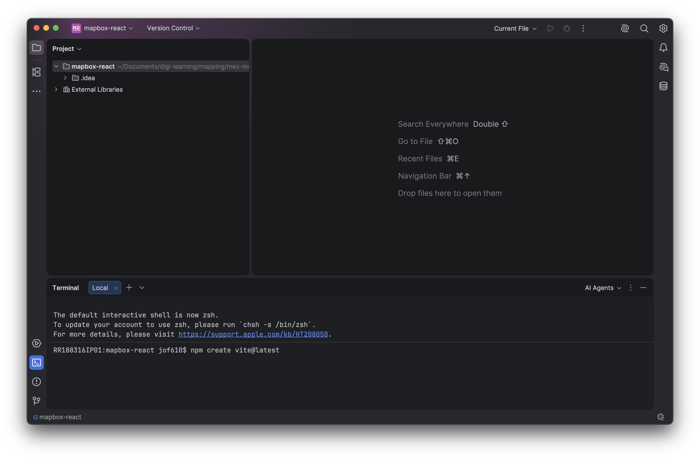

When we're asked to enter a project name, we can choose different approaches depending on the IDE we are using and how it works. 
- If your IDE creates a new directory when you start a new project (for example, JetBrains IDEs), then just enter `.`. This will create a project in the current directory. If you enter a project name here, it will create another directory inside this one, and we don't want that.
- If your IDE does not automatically create a new directory, then enter a project name here, and the Vite build process will create the new project directory for you.

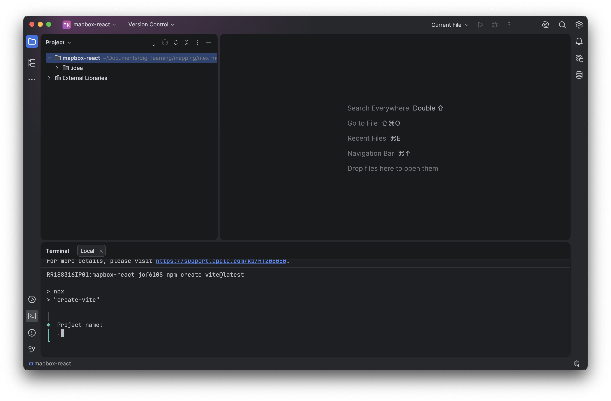

If you entered `.`, and if there are already files in the current directory, Vite wants to know what to do with them. We tell it to just ignore the files and continue.

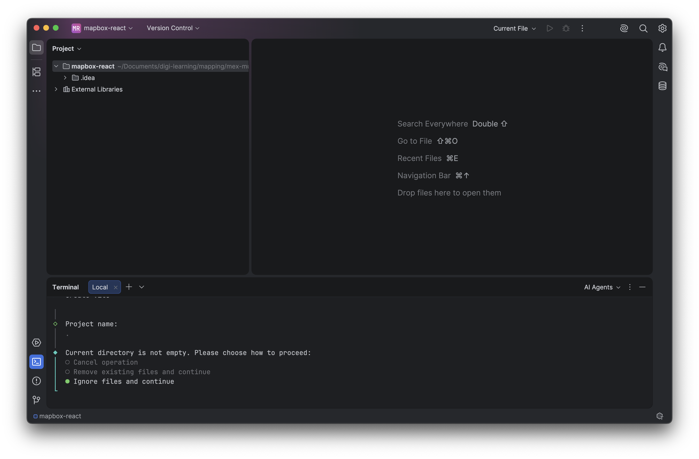

When it asks you to select a framework, select React.

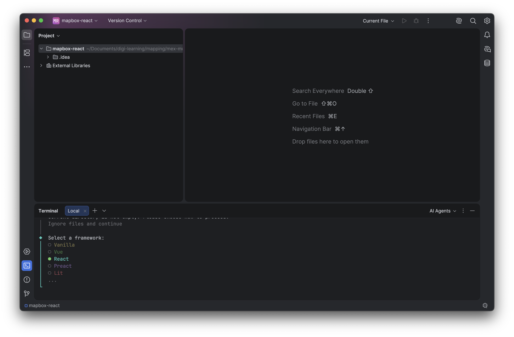

When asked to select a variant, select JavaScript.

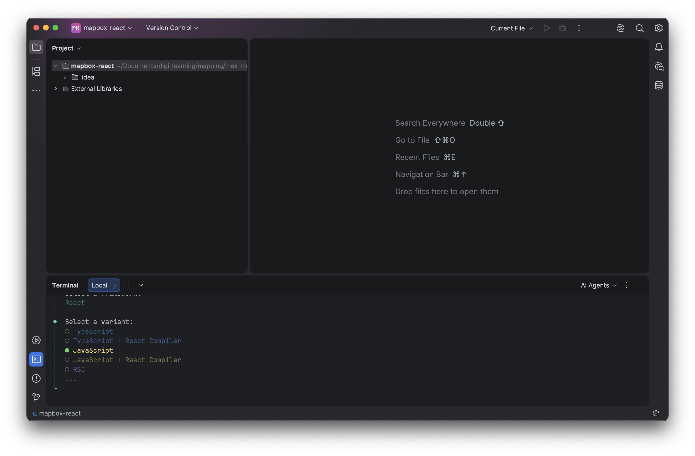

Now you're ready to install.

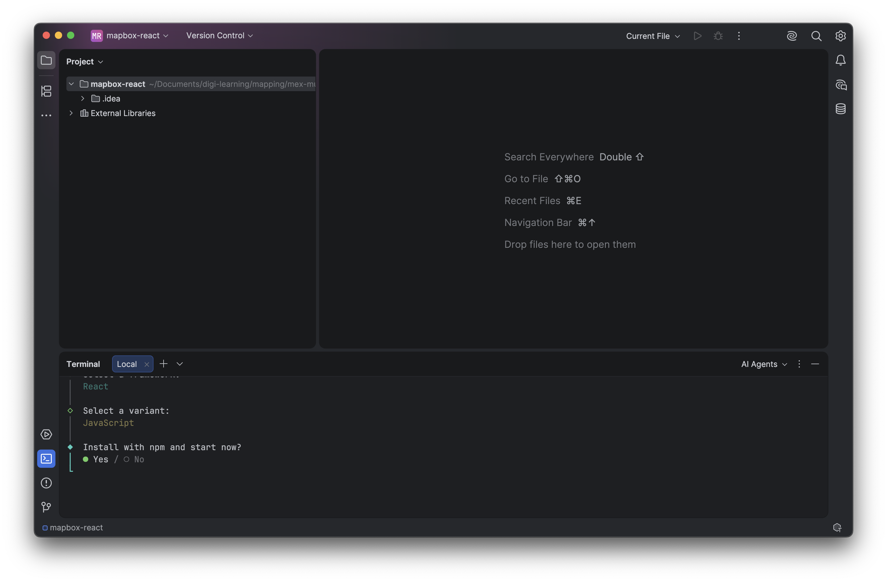

Vite will install a whole React development framework, including a `package.json` file, and then run `npm install` to install all the Node dependencies. When it's done, it will start a dev server and let you know what address it's running on.

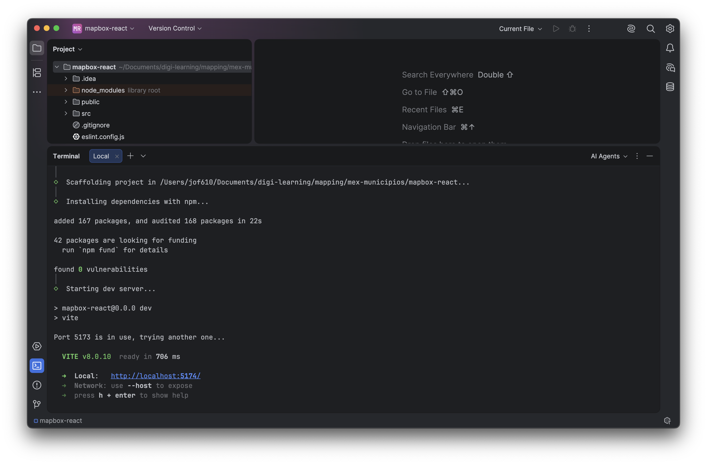

## Get React working

As helpful as Vite is, we aren't going to use its file contents. We'll go ahead and delete all the contents of the `src` directory.

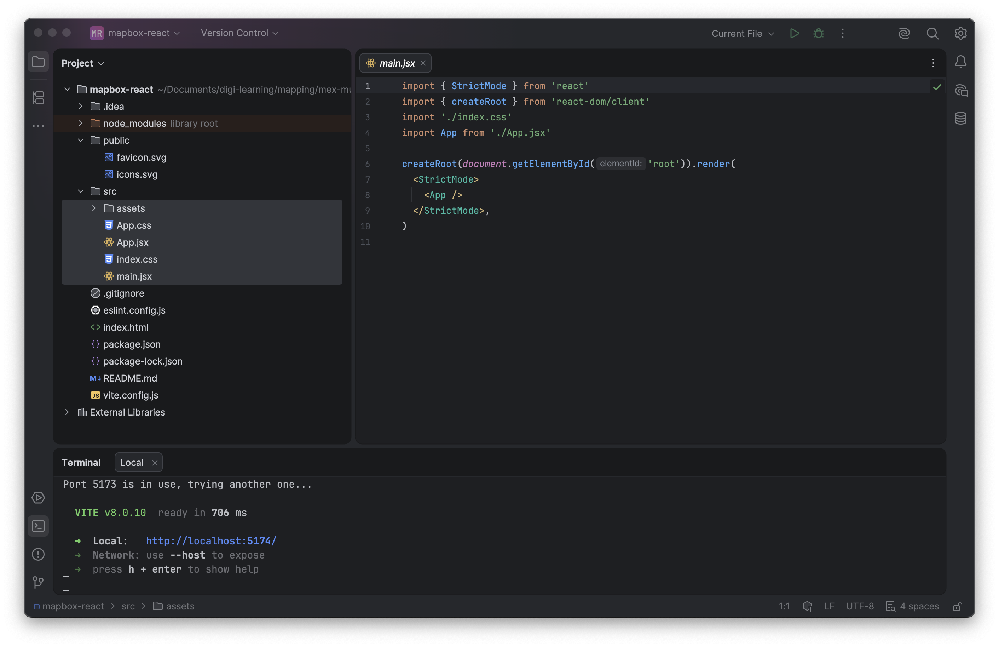

In the public folder, we'll delete the `icons.svg` file. I also delete the `eslint.config` file because this file causes strict error checking, which I find a bit overwhelming. That's a matter of personal preference.

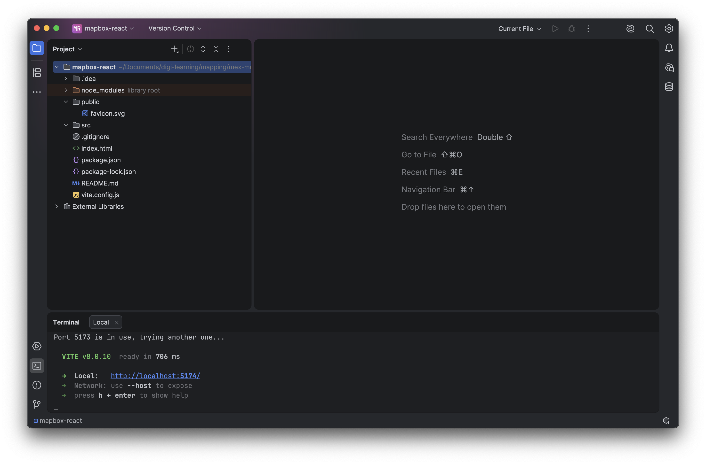

Now we'll create a file called `main.jsx`. Inside this file create the following content:

```jsx
import React from 'react';
import ReactDOM from 'react-dom/client';

const el = document.getElementById('root');
const root = ReactDOM.createRoot(el);

function App(){
    return <div>Hello World!</div>
}

root.render(<App />);
```

Once this is done, if we go to the Vite dev server address, we'll see the output "Hello World!". 

If the server ever gets shut down, we can restart it with the command `npm run dev`.

Let's pause to understand what is happening here.

First, we are importing two Node libraries, React and ReactDOM. 

```jsx
import React from 'react';
import ReactDOM from 'react-dom/client';
```

React is the core framework, and ReactDOM applies that framework to a web environment.

Then, we get a reference to the `root` element: `const el = document.getElementById('root');`. This element is in the `index.html` file. If you look in the `index.html` file, you will see there is an element with an id of `root`. There is also a script-link to the `main.jsx` file. This means the `index.html` file will load the `main.jsx` file, the `main` script will run, and the script will get a reference to the `root` element.

The next line, `const root = ReactDOM.createRoot(el);`, tells React to take control of the `root` element and use that as the root for rendering content.

Now, we create our first component. 

```jsx
function App(){
    return <div>Hello World!</div>
}
```

By convention, we call our base component `App`. This is a [JSX](https://en.wikipedia.org/wiki/JavaScript_XML) function. React components are functions that return JSX. This one just returns a div that has the content "Hello World!".

Finally, we tell React to show that content on the screen with `root.render(<App />);`. This will take that reference to a React root and tell React to render the content there. With these first steps, we begin using React to render content.

## Create App and Map Components

### The App Component

Now we are going to start making a component hierarchy. In React, we think of apps and web content as consisting of components. Components are functions that return JSX.

Inside our `src` directory we will create a file called `App.jsx`. We'll take the function we wrote in `main.jsx` and copy it over to `App.jsx`. Then we will **export** the function.

`App.jsx`:
```jsx
function App(){
    return <div>Hello World!</div>
}

export default App;
```

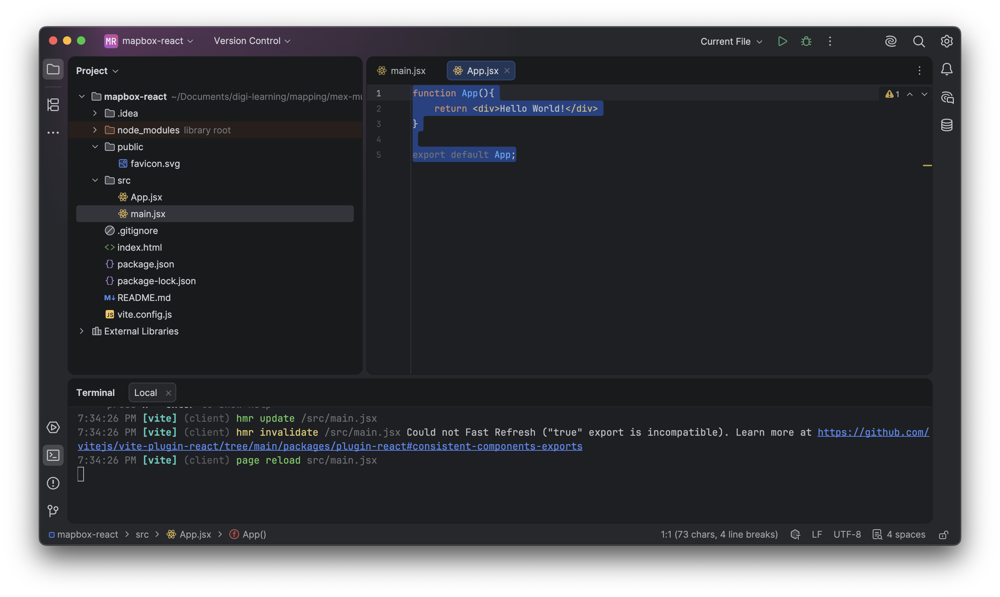

Now we return to `main.jsx`. We delete the App function in that file. Instead, we put an import statement at the top with a link to the App file. Now the function lives in a separate App component, which **exports** it, and then we **import** it in `main.jsx`. This makes use of the JavaScript **module** system.

`main.jsx`:
```jsx
import React from 'react';
import ReactDOM from 'react-dom/client';
import App from "./App";

const el = document.getElementById('root');
const root = ReactDOM.createRoot(el);

root.render(<App />);
```

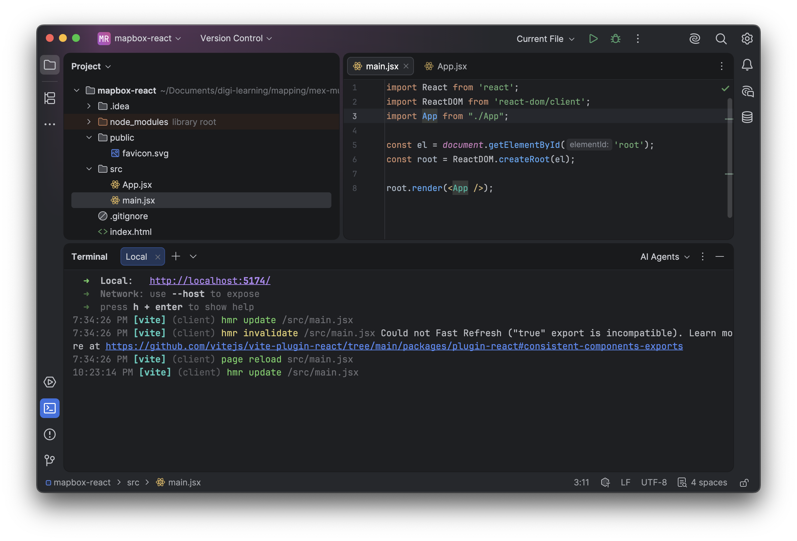

At this point, the app works exactly as it did before, rendering the content "Hello World!", but it has a more scalable component structure.

### The Mapbox Token

So far we have just created a very basic React framework. Now we want to bring in a Mapbox map. To do this, we'll need a Mapbox API key and a place to store it.

When we created our Vite project, Vite created a file called .gitignore, which is a list of all files and directories that Git version control should ignore in this project. We are going to add `.env.local` to the gitignore file.

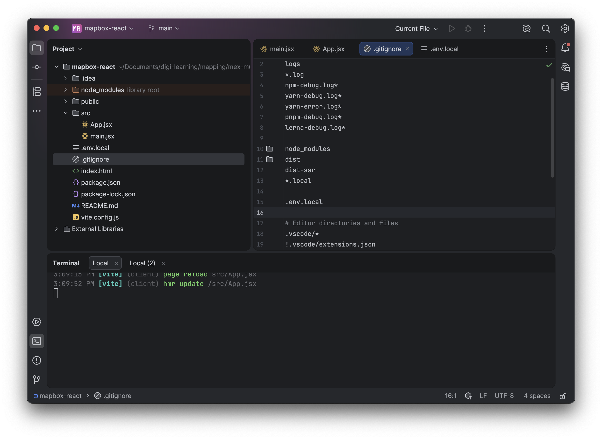

Now we'll create the `.env.local` file in the root of our project directory. We'll leave it empty for now.

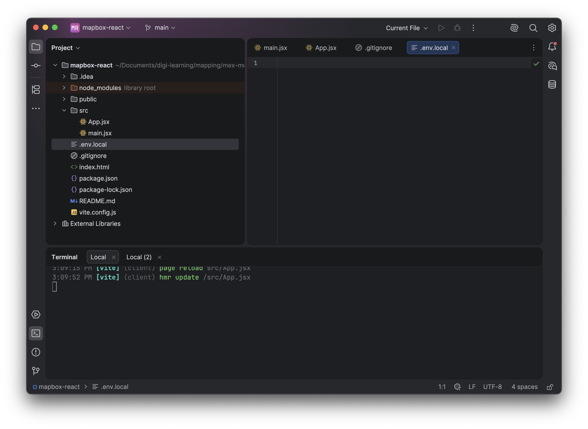

For the next step, we are going to need a Mapbox API key. We go to [mapbox.com](mapbox.com). If we don't already have one, we make a free account. In our account overview we should see a "Default public token". We'll copy this. For projects that will be made public, you should create a [url-restricted token](https://docs.mapbox.com/accounts/guides/tokens/#url-restrictions) but for learning purposes, the default public token is fine.

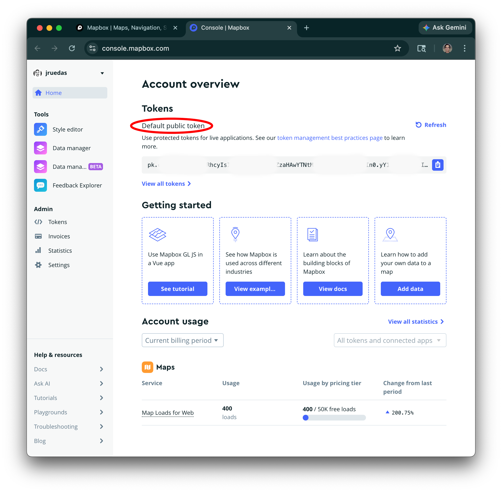

In .env.local, we now declare a variable called `VITE_MAPBOX_TOKEN` and set its value to the token: `VITE_MAPBOX_TOKEN=your-mapbox-token`. We don't put quotes around the token value.

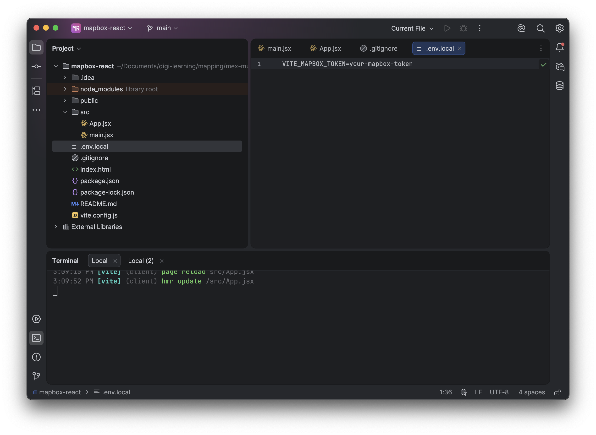

The `.env.local` file is where we'll put any API tokens or keys that our app might use. We put this file in our gitignore list so it will never be shared if we want to share our project. Note that this will work only in a Vite environment. We could also put it in a file called `keys.js` and export it using the JavaScript module system.

Now we need to install the Mapbox GL JS React library. We'll open a second terminal window and enter `npm install mapbox-gl`. This will install the official Mapbox GL JS package for use with the React framework.

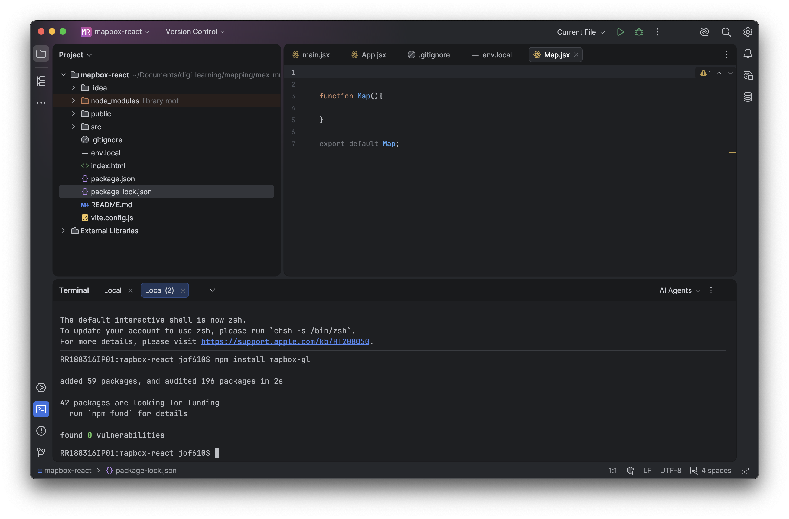

### The Map Component

We are now ready to start working on our Map component. Inside `src`, we'll create a `components` directory. Inside `components`, we will create a file called `Map.jsx`. Inside the Map component, for now we'll just create the Map function and export it.

`Map.jsx`:
```jsx
function Map(){

}

export default Map;
```

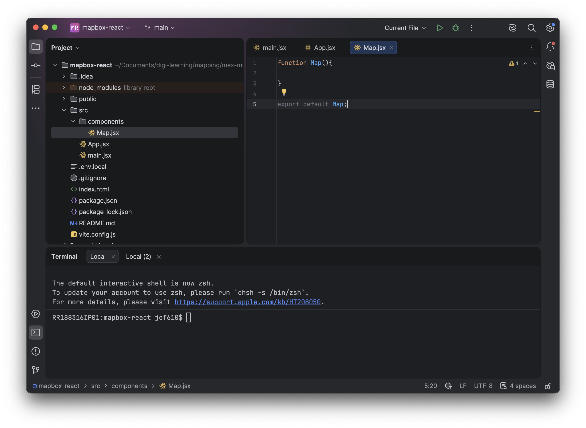

We'll have the Map function return a div with the id "map-container":

`Map.jsx`:
```jsx
function Map(){
    return <div id='map-container'></div>
}

export default Map;
```

Next we'll set up our imports at the top of the file. First, we'll import two React **hooks**. Hooks are functions that allow our code to use React's built-in features. UseEffect and useRef are two basic built-in React hooks.

Second, we'll import the Mapbox GL library that we installed earlier. We also need to import the default Mapbox style sheet, or the map won't render correctly.

`Map.jsx`:
```jsx
import { useEffect, useRef} from "react";
import mapboxgl from 'mapbox-gl';
import 'mapbox-gl/dist/mapbox-gl.css';

function Map(){
    return <div id='map-container'></div>
}

export default Map;
```

### Give the Map Width and Height

Now we'll do some do a bit more basic framework setup. We need custom style sheets for the App and Map components, we need to link the components to their style sheets, and we need connect the App and Map components so the map gets rendered.

First, we'll create a new subdirectory of `src` called `css`. Inside this directory, we'll create two style sheets, `App.css` and `Map.css`.

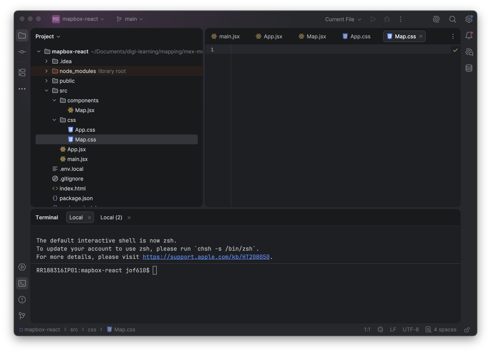

In our Map component's style sheet, we'll add a selector for the div with the `map-container` id, and give it width and height. Without this, the map won't show up on the page.

`Map.css`:
```css
#map-container {
    width: 100%;
    height: 100%;
}
```

Now we'll import the style sheet into the Map component by adding this import statement in `Map.jsx`: `import '../css/Map.css';`.

Next, let's move over to the App component. We're going to import the Map component into the App component and replace the Hello World message with the Map component. We'll also give the div that wraps the Map component an id so we can add style rules for it. And we need to import the App style sheet.

`App.jsx`:
```jsx
import Map from "./components/Map";
import './css/App.css';

function App(){
    return <div id="page-wrapper">
       <Map />
    </div>
}

export default App;
```

Here, we are making the Map component a child of the App component. Notice we're importing the Map component at the top. Then, in our JSX return, we return the Map component inside a wrapping div.

In our App component style sheet, we'll make sure the `#page-wrapper` div  gets the full viewport height. Since we told the map to occupy 100% of available space, and its wrapper occupies the whole viewport, this means the map will start out occupying the entire browser viewport.

`App.css`:
```css
* {
    margin: 0;
    padding: 0;
    box-sizing: border-box;
}

#page-wrapper {
    height: 100dvh;
    width: 100dvw;
}
```

### Render the Map

Now we're ready to write the code that outputs the map. At the top of the Map function, above the return value, we'll add a couple of refs and a `useEffect` hook:

`Map.jsx`:
```jsx
    const mapRef = useRef(null);
    const mapContainerRef = useRef(null);

    useEffect(() => {
        mapboxgl.accessToken = import.meta.env.VITE_MAPBOX_TOKEN;
        mapRef.current = new mapboxgl.Map({
            container: mapContainerRef.current,
        });

        return () => {
            mapRef.current.remove()
        }
    }, [])
```

Let's go over what we're doing here. Earlier we imported the `useRef` hook from React. The `useRef` hook is typically used in React to hold references to DOM elements, and sometimes to other values that need to be persisted across component renders. In this case we're using one ref to hold a reference to the map itself, a second ref for the map container. We start by creating empty (`null`) refs.

Next, we use the `useEffect` hook. This hook is used to synchronize components with external systems. In this case, we are communicating with the Mapbox API and generating a Map based on the returns of that network connection.

`useEffect` takes a function and an array as its arguments. The function argument determines what happens, and the array determines when it happens. In this case we pass it a function and an *empty* array. The empty array means the function will run once, when the component renders.

Inside the function, we first get the Mapbox token that we retrieved and stored earlier. The Mapbox API won't let us connect without this token. Next, we take the `mapRef` ref variable that we declared earlier, and we set its value to be a new Mapbox map.

The `new Map()` function takes an object as its argument. The object specifies how the new Map should be configured. To start with we keep it as simple as possible. We just tell it where its container is. Its container will be the current value of the map container ref that we declared earlier.

The return value of a useEffect is always a function. This function runs usually when a component is re-rendered or, if it only renders once -- as this one does -- when the component unmounts. This is typically a **cleanup** function, which removes any lingering refs or other artifacts of the useEffect that may interfere with correct app function in the future. We don't want wandering map refs anywhere in memory, so we use the cleanup function to remove these refs.

There is one more important edit we need to make. In the return statement to the Map function, we need to add the ref as a property (or *prop*) of the JSX component: `return <div id="map-container" ref={mapContainerRef}></div>`. This means the map-container div will be connected to the `mapContainerRef` we declared earlier. Remember, we configured the new map to expect that its container would be the element referenced by `mapContainerRef`, but at that time the ref was set to null. Now we're specifying an element for that ref.

Here is the full content of our Map component so far:

`Map.jsx`:
```jsx
import { useEffect, useRef} from "react";
import mapboxgl from 'mapbox-gl';
import 'mapbox-gl/dist/mapbox-gl.css';
import '../css/Map.css';

function Map(){
    const mapRef = useRef(null);
    const mapContainerRef = useRef(null);

    useEffect(() => {
        mapboxgl.accessToken = import.meta.env.VITE_MAPBOX_TOKEN;
        mapRef.current = new mapboxgl.Map({
            container: mapContainerRef.current,
        });

        return () => {
            mapRef.current.remove()
        }
    }, [])

    return <div id="map-container" ref={mapContainerRef}></div>
}

export default Map;
```

When we go to our dev server address, we should now see a Mapbox map displayed on the browser viewport.

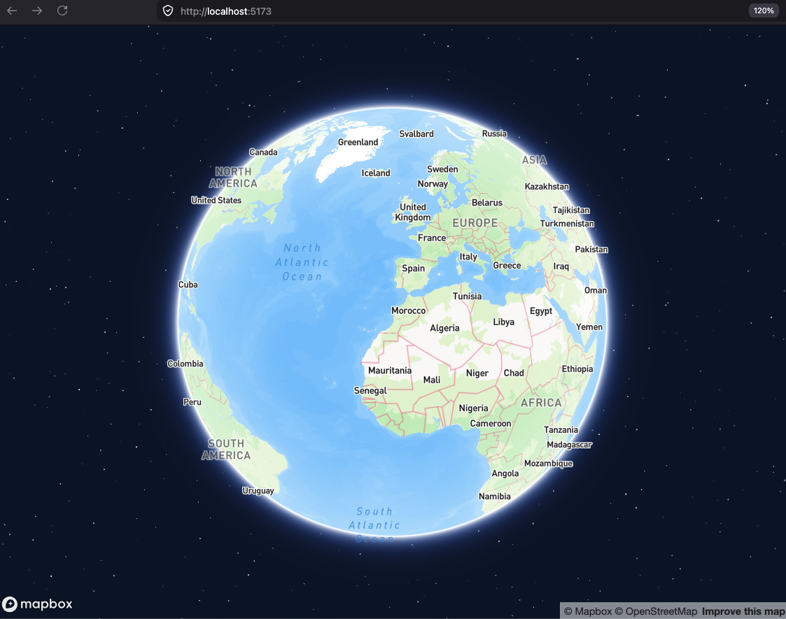

### Configuration Basics

We noticed earlier that the `new Map()` function takes a configuration object as its argument. We started with just one property, `container`. It's more usual to add more configuration properties, especially `center` and `zoom` and maybe also `style`.

The `center` property takes an array of numbers representing the longitude (`lng`) and latitude (`lat`) that the map will center on when it first loads. The `zoom` property tells the map how far to zoom  in when it loads. These settings will center and zoom the map on UT San Antonio:

```jsx
mapRef.current = new mapboxgl.Map({
            container: mapContainerRef.current,
            center: [-98.6166945097312, 29.585128528764358],
            zoom: 12
        });
```

You can also change the style from standard to satellite:

```jsx
mapRef.current = new mapboxgl.Map({
            container: mapContainerRef.current,
            center: [-98.6166945097312, 29.585128528764358],
            zoom: 12,
            style: 'mapbox://styles/mapbox/standard-satellite'
        });
```

## Adding Data

### Mexican State and Municipal Boundaries

We're going to build an application that shows the population of Indigenous groups in Mexico, broken down by state and municipality. We'll start by finding data to use.

We can get geographic data from [INEGI](https://www.inegi.org.mx/default.html), the Mexican government's Institute for Statistics and Geography. They offer good [base maps](https://www.inegi.org.mx/descarga-mapa/). We'll take the [base map file suitable for QGIS](https://www.inegi.org.mx/contenidos/descarga-mapa/proyectos-sig/nal-QGis.zip), which is a free geographic information system (GIS) software.

After downloading the zip file, when we open the zip, we two files: a geopackage (.gpkg) and a QGIS project file (.qgz). 

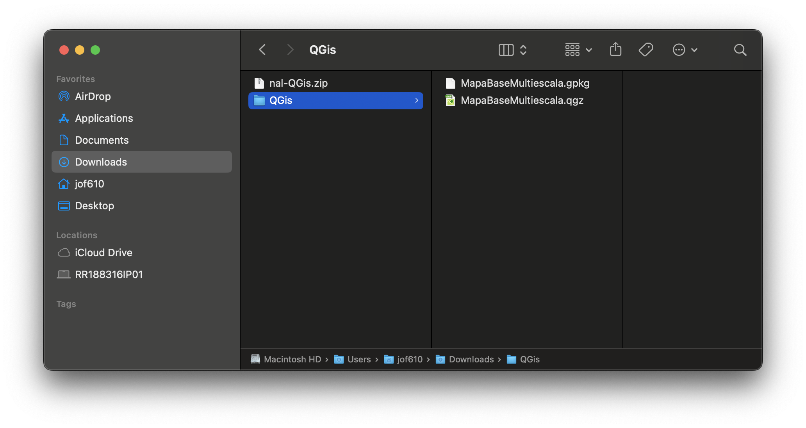

We can open QGIS, then drag and drop either of the two files into the QGIS window to open a new project with the data.

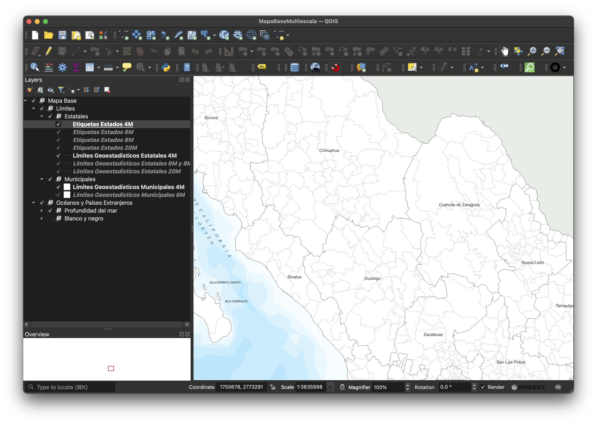

In the layers pane we see layers labeled "Etiquetas Estados" (state labels), "Límites Geoestadísticos Estatales" (geo-statistical state limits), and "Límites Geoestadísticos Municipales" (geo-statistical municipal limits). We will take the municipal limit layer.

We right click on the municipal limits layer and select Export --> Save Features As.

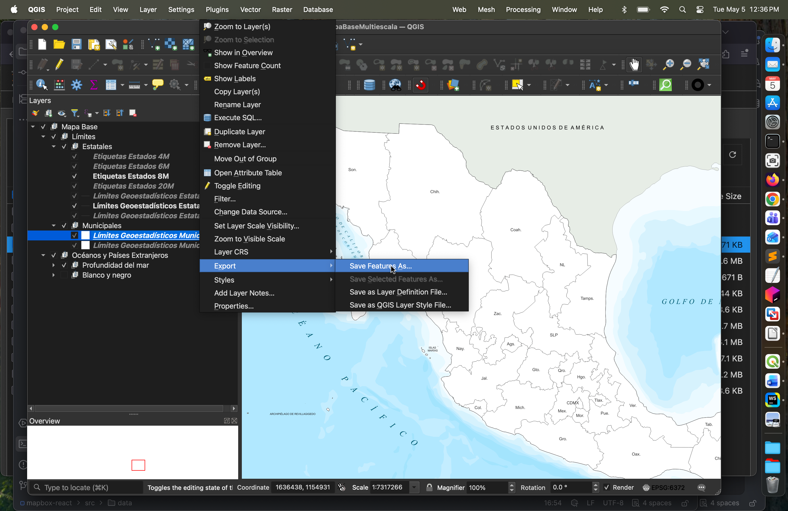

In the export dialogue, GeoJSON will be automatically selected as the format. We have to specify the name of our output file name and where we want to put it in our file system. QGIS will automatically add `.geojson` to any file name you select. We want to save the file to a new subdirectory in our `src` directory, called `data`.

Under CRS, we need select EPSG:4326, since this is the projection that Mapbox uses. At the bottom, we can uncheck "Add saved file to map" since we won't actually be using this in QGIS. We're just using QGIS as a way to inspect the layers in a geopackage file and output the ones we want into GeoJSON format, which Mapbox will be able to read.

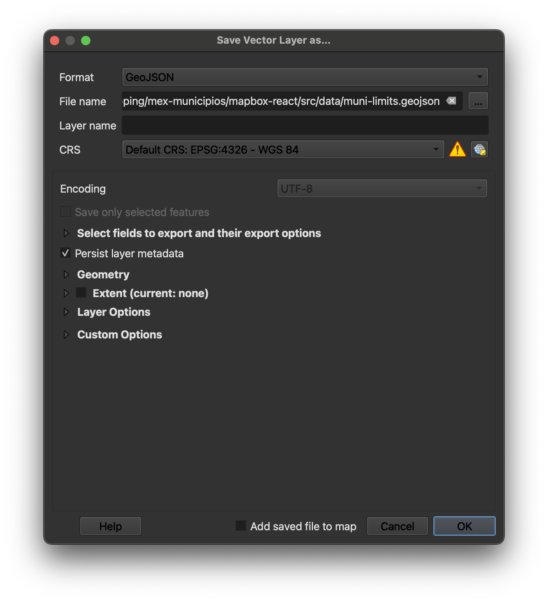

The result should be a few new files in our new `data` directory.

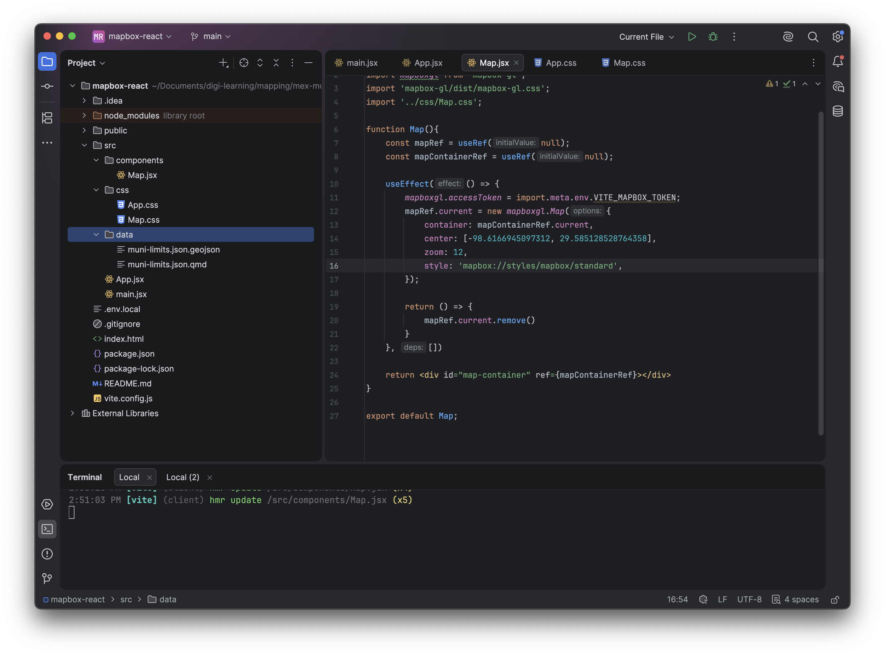

We need to rename the geojson file to just have the `.json` file ending, or Mapbox will not read it correctly. We also don't need the `.qmd` file that QGIS created.

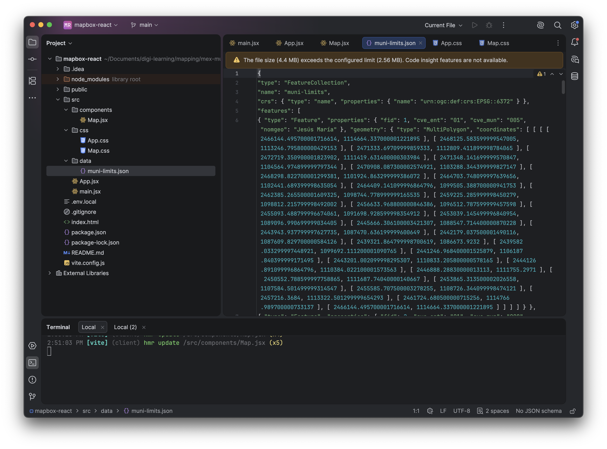

### Adding Layers in Mapbox

Now we can add the GeoJSON data as a layer to our Mapbox base map. Mapbox's standard map style already has Mexican state boundaries, so the municipal boundaries will fit within Mapbox's existing map data. 

To add layers, we first need to add the data as a source. We'll use the [addSource method](https://docs.mapbox.com/mapbox-gl-js/api/map/#map#addsource). This method accepts two arguments. The first should be a string, which is a unique name we give the source. The second argument is an object that specifies the [type of source](https://docs.mapbox.com/style-spec/reference/sources/) and the source itself.

The source can't be added until the map has loaded, or we'll get an error. So we have to add some code to ensure that map loads first, and only then does the source get added.

First we import the JSON. In `Map.jsx`, we can add the import: `import municipios from '../data/muni-limits.json';`. Then, in the same `useEffect` that generates the map, we'll write:

`Map.jsx`:
```jsx
 mapRef.current.on('load', () => {
           mapRef.current.addSource('municipios', {
               type: 'geojson',
               data: municipios
           })
        });
```

On its own, this will have no visible effect on our map. It just adds a data source. To visualize the data we'll have to specify a layer with instructions on how to render the data on the map. We'll use the [addLayer method](https://docs.mapbox.com/mapbox-gl-js/api/map/#map#addlayer). We'll have to specify the data source and type of layer. The list of layer types can be found in the [layers documentation](https://docs.mapbox.com/style-spec/reference/layers/#type). For this layer we could use "fill" if we wanted to add colors to each muncipality, but since we just want the boundary lines, we can use "line".

Once we've selected a type, we can either accept the default presentation for that type, or we can customize it with the paint property or layout properties. Each layer type has its own paint and/or layout property options. For example, for the [line type paint property](https://docs.mapbox.com/style-spec/reference/layers/#line) we can specify the color and width, among many other options.

We'll start by rendering the layer with default line options (no custom paint property). Underneath the `addSource` method, we write an `addLayer` method:

`Map.jsx`:
```jsx
 mapRef.current.addLayer({
                id: 'municipal-limits',
                type: 'line',
                source: 'municipios'
            });
```

We also need to change the center and zoom properties we specified earlier, which focusεδ on San Antonio. To center on Mexico, we can set the properties as follows: `center: [-103.7294, 23.8002], zoom: 4.23`.

Our Map component now looks like this:

`Map.jsx`:
```jsx
import { useEffect, useRef} from "react";
import mapboxgl from 'mapbox-gl';
import 'mapbox-gl/dist/mapbox-gl.css';
import '../css/Map.css';
import municipios from '../data/muni-limits.json';

function Map(){
    const mapRef = useRef(null);
    const mapContainerRef = useRef(null);

    useEffect(() => {
        mapboxgl.accessToken = import.meta.env.VITE_MAPBOX_TOKEN;
        mapRef.current = new mapboxgl.Map({
            container: mapContainerRef.current,
            center: [-103.7294, 23.8002],
            zoom: 4.23,
            style: 'mapbox://styles/mapbox/standard'
        });

        mapRef.current.on('load', () => {
           mapRef.current.addSource('municipios', {
               type: 'geojson',
               data: municipios
           });

            mapRef.current.addLayer({
                id: 'municipal-limits',
                type: 'line',
                source: 'municipios'
            });
        });

        return () => {
            mapRef.current.remove()
        }
    }, [])

    return <div id="map-container" ref={mapContainerRef}></div>
}

export default Map;
```

When we look at the map, we can now see the boundary lines for Mexican municipalities.

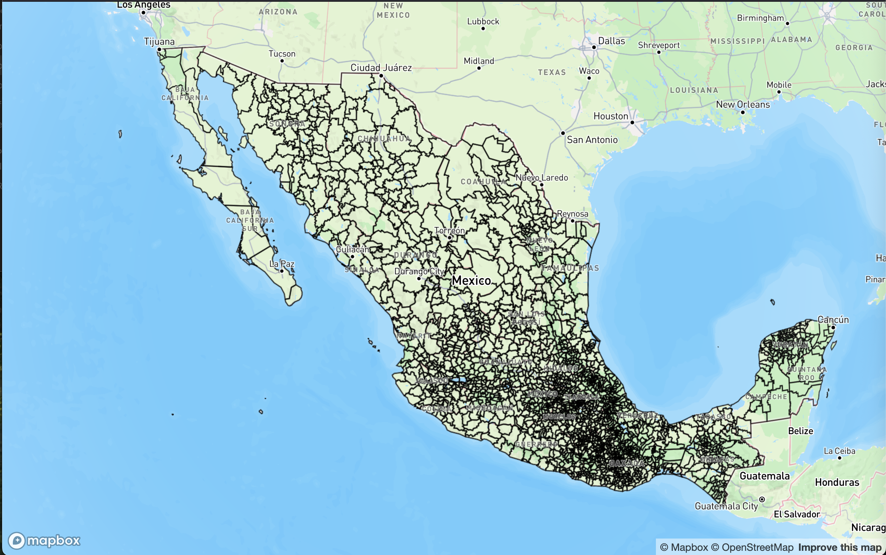

The lines appear a bit thick, so we can use the addLayer method's `paint` property to customize the layer style.

`Map.jsx`:
```jsx
 mapRef.current.addLayer({
                id: 'municipal-limits',
                type: 'line',
                source: 'municipios',
                paint: {
                    "line-width": 0.1
                }
            });
```

If we want to show the municipality labels, we need to add a separate text layer. This will be a layer of type [symbol](https://docs.mapbox.com/style-spec/reference/layers/#symbol). Symbol layers are used for both icons and text labels. Instead of a paint property, we're going to give this layer a [layout property](https://docs.mapbox.com/style-spec/reference/layers/#layout-property). The documentation for each layer type will always tell us whether to use paint or layout, or a combination, for that type.

For text, the fundamental layout property that tells Mapbox what to render is the `text-field` property. This can be used to provide a hard-coded value, but in this case we want each municipality to have its own label. For this, we'll to use an [expression](https://docs.mapbox.com/style-spec/reference/expressions/) as the property's value. Specifically, we'll use a [data expression](https://docs.mapbox.com/style-spec/reference/expressions/#data-expressions) to retrieve feature properties.

How do we know what feature we need to retrieve? Here we may find it helpful to go back to QGIS and look at the layer attribute table. Making sure the municipal data layer is selected, we can find the attribute table icon, or just press F6.

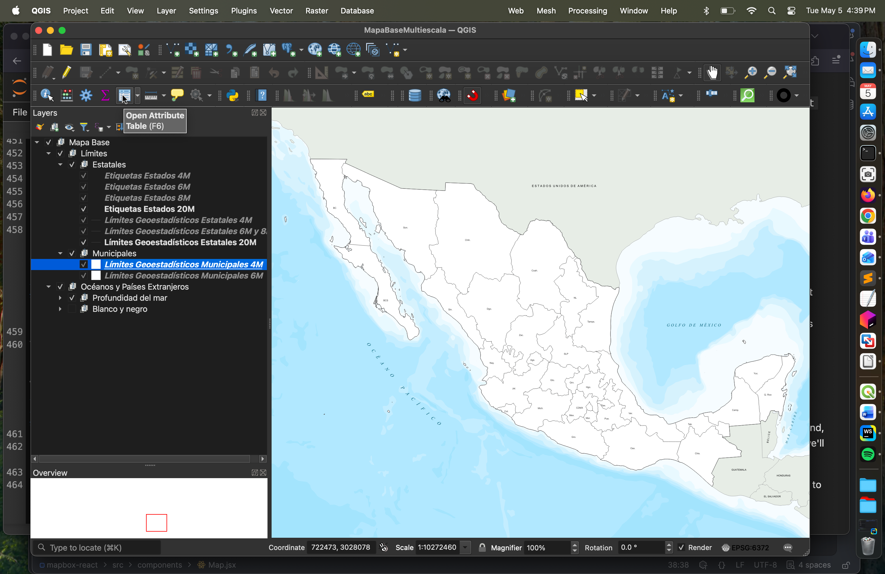

With the attribute table open, we look for the title of the column that contains the municipality names. In this case, it is called "nomgeo".

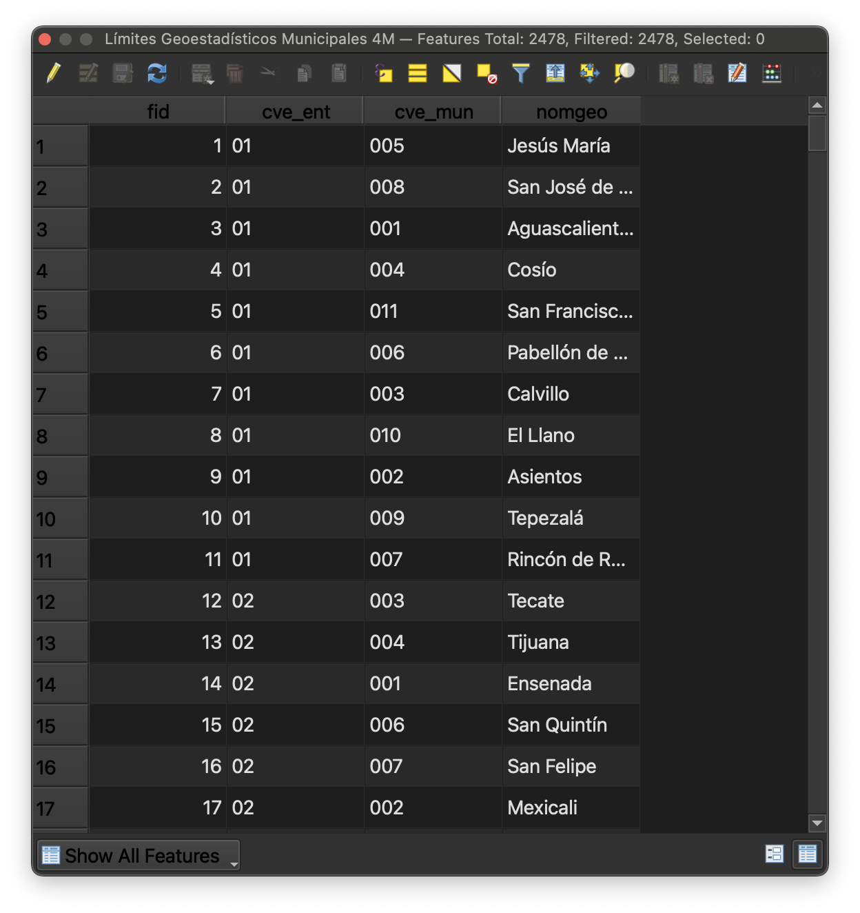

Back in our IDE, we can now write our expression, specifying the `get` data operator and the name of the field to retrieve. We can also control the text size. We could customize many other text properties.

`Map.jsx`:
```jsx
mapRef.current.addLayer({
                id: 'municipal-labels',
                type: 'symbol',
                source: 'municipios',
                layout: {
                    "text-field": ['get', 'nomgeo'],
                    "text-size": 10.5
                }
            });
```

We should now be able to see the names of the municipalities.

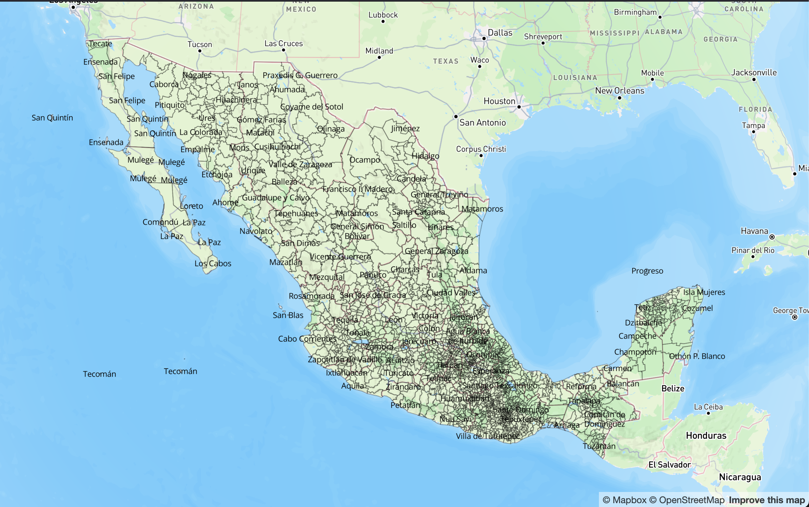

## A Dropdown Filter

Now we're going to enable the user to filter by state. To do this, we're going to build a dropdown menu with options for each Mexican state, then wire that to the map so our map layer gets a filter that follows the user's selection.

### Displaying the Dropdown

To populate the menu, we'll want to create a list of all the Mexican states. We already have that in the geopackage we obtained from INEGI. We'll need to reshape the data to suit our needs. Python is very good at reshaping text data, so we'll use Python to read the geopackage, select the appropriate layer, reshape the data, and create a JSON file for our application.

The Python snippets that follow assume use of a Notebook such as Jupyter Notebook or Google Colab.

We can load a geopackage file and inspect its layer structure using the `geopandas` library:

```python
import geopandas as gpd

gpd.list_layers('MapaBaseMultiescala.gpkg')
```

Once we know the name of the layer we want to use, we can inspect it by turning it into a data frame.

```python
gdf = gpd.read_file('MapaBaseMultiescala.gpkg', layer='etiquetas_estados')
gdf
```

Once we've determined that we correctly selected the layer that has the data we need, we can exclude the data we don't need, and rename the columns to suit our needs. Here, we're creating a new data frame with just the state names and geographic codes, and we're renaming the columns from "cvegeo" and "nomgeo" to the simpler "code" and "name".

```python
estados_df = (
    gdf[['cvegeo', 'nomgeo']]
    .rename(columns={
        'cvegeo': 'code',
        'nomgeo': 'name'
    })
)
```

We'll then convert it into a Python dictionary format, which is identical to the JavaScript object we'll eventually use. We can store the resulting data in a file.

```python
import json

estados = estados_df.to_dict(orient='records')

with open("mex-states.json", "w", encoding="utf-8") as f:
    json.dump(estados, f, ensure_ascii=False, indent=2)
```

Now we can transfer that JSON file into our `src/data` directory.

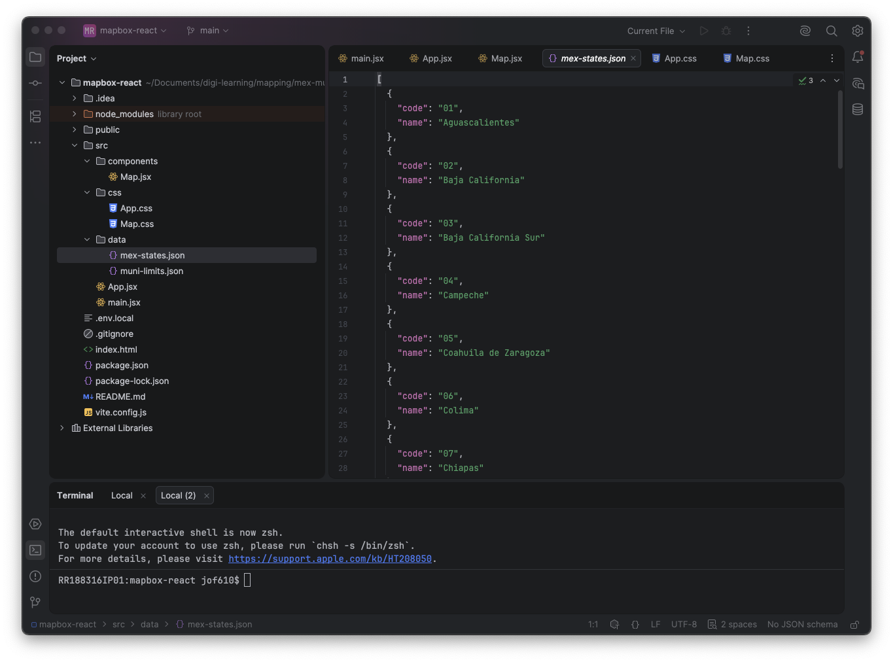

There are a couple of things we can do to clean up the data before we use it. In the data set there is a rogue newline character in entry 09. Let's remove that.

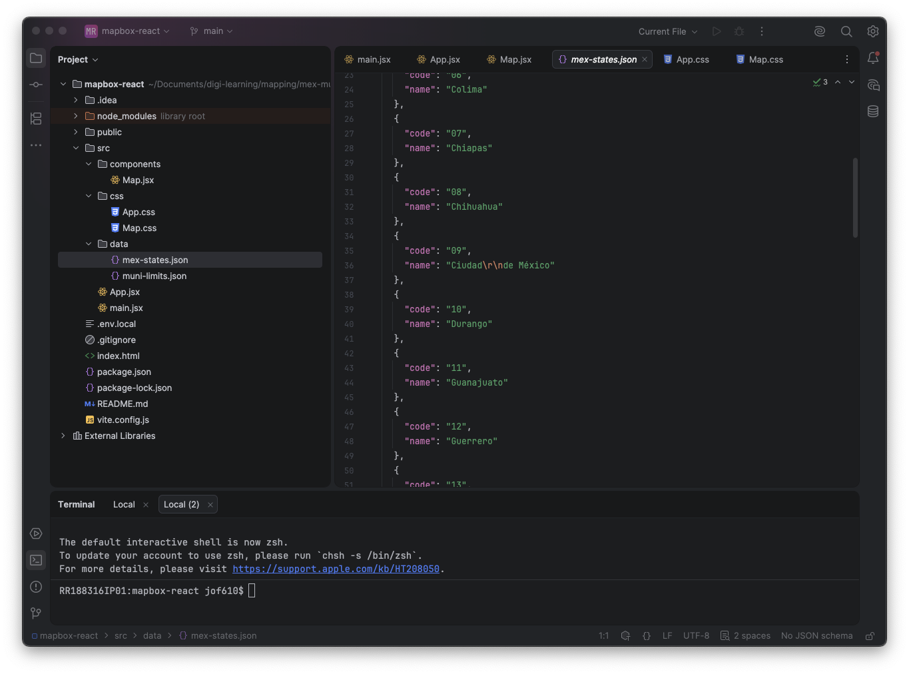

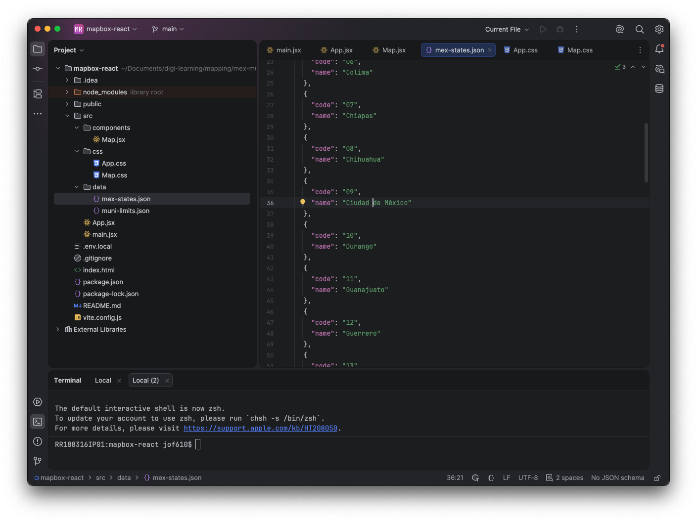

We can also edit the entries for Coahuila, Michoacán and Veracruz so they just read "Coahuila", "Michoacán", and "Veracruz". These are the more familiar and compact names.

We are now ready to construct our dropdown. A basic dropdown has the following structure:

```html
<label for="pet-select">Choose a pet:</label>

<select name="pets" id="pet-select">
  <option value="">--Please choose an option--</option>
  <option value="dog">Dog</option>
  <option value="cat">Cat</option>
  <option value="hamster">Hamster</option>
  <option value="parrot">Parrot</option>
  <option value="spider">Spider</option>
  <option value="goldfish">Goldfish</option>
</select>
```
Source: [Mozilla Developer Network](https://developer.mozilla.org/en-US/docs/Web/HTML/Reference/Elements/select)

- A `select` element wraps around a set of `option` elements. 
- Each `option` element has a `value` attribute. 
- The `select` element should have an `id` attribute, which corresponds to the `label` element's `for` attribute. 
- The connection between the `select` element `id` attribute and the `label` element `for` attribute is important for accessibility
- In our scenario, the `select` element's `name` attribute is not necessary. This attribute is used to package information for remote servers, but in our app we will use React's state system instead.

Earlier, we added `code` values we added to our JSON file. Each state has a unique individual code. We'll use these now to populate the `value` attributes for each `option` element. 

Our JSON file also has `name` properties for each state. We'll use these to generate the option content that the user actually sees. 

We're going to import the JSON content to our App component, and from there we'll pass it down to our Dropdown component as a prop. 

We're going to make our Dropdown component reusable, so all our props should be variables that we can change later on. To populate the `select` element's `id` attribute and the `label` element's `for` attribute we'll use a prop called `id` that we'll use for both those attributes.

First, we'll create the outline of the Dropdown component and save it in the `src/components` directory:

`Dropdown.jsx`:
```jsx
function Dropdown(){
    
}

export default Dropdown;
```

Now we can import the component into our App component, and set it as a child of App and sibling of Map.

`App.jsx`:
```jsx
import Map from "./components/Map";
import './css/App.css';
import Dropdown from "./components/Dropdown";

function App(){
    return <div id="page-wrapper">
       <Dropdown />
       <Map />
    </div>
}

export default App;
```

Next, let's import the states JSON and set it as a variable called `states`. We'll then pass this data into the Dropdown component as a prop called `options`, along with an `id` prop. This way we'll get the list of states from the JSON file and pass it into our Dropdown component.

`App.jsx`:
```jsx
import Map from "./components/Map";
import './css/App.css';
import states from './data/mex-states.json';
import Dropdown from "./components/Dropdown";

function App(){
    return <div id="page-wrapper">
       <Dropdown
           options={states}
           id="state"
       />
       <Map />
    </div>
}

export default App;
```

Back in our Dropdown component, we'll receive the `options` and `id` props. Then, we'll create the basic outline of our JSX return.

`Dropdown.jsx`:
```jsx
function Dropdown( {options, id }){
    return <div>
        <label></label>
        <select>
            
        </select>
    </div>
}

export default Dropdown;
```

We can use the props we passed in to our Dropdown component to populate the dropdown attributes and content. 
- We'll use the `id` prop to populate the label and the `select` element's `id` attribute. 
- We'll use some JavaScript to capitalize the `id` prop value and use it as the visible label content.
- We'll use the `options` prop to generate the dropdown options. 
- We'll use the built-in JS `.map` function for this, which is a very common React development pattern. 
- When we use `.map` in React we have to give each resulting element a unique `key` attribute.

`Dropdown.jsx`:
```jsx
function Dropdown( {options, id }){
    return <div>
        <label htmlFor={id}>{id.charAt(0).toUpperCase() + id.slice(1)}</label>
        <select id={id}>
            {
                options.map(option => (
                        <option
                            value={option.code}
                            key={option.code}
                        >
                            {option.name}
                        </option>
                    ))
            }
        </select>
    </div>

}

export default Dropdown;
```

At this point, we should see the dropdown appear above our map, with the correct list of states. Our next step is to style it a bit.

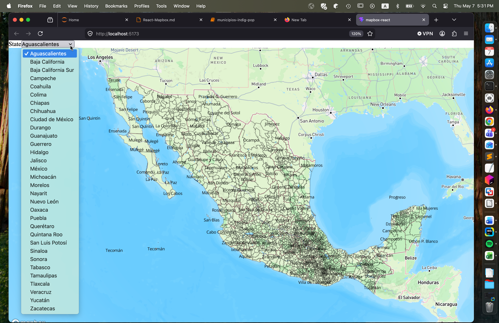

### Styling the Dropdown

There are many different ways to style a dropdown, from fully customized JavaScript-driven approaches, to imported components and libraries, to simple CSS tweaks. For simplicity, we'll use a very basic all-CSS approach, though this will limit how far we can customize the dropdown in relation to the browser default.

This approach is adapted from an example by [Stephanie Eckles](https://codepen.io/5t3ph/pen/MWyyYNz).

First, we'll create a `Dropdown.css` file in the `src/css` directory, and import the file into our Dropdown component. The import statement is `import '../css/Dropdown.css';`.

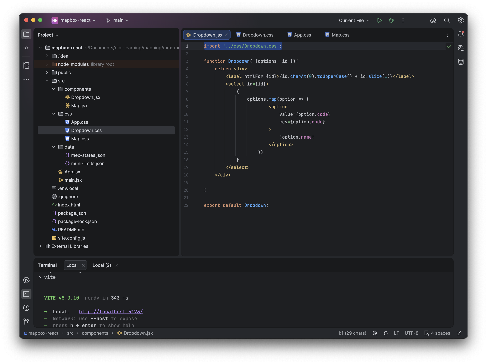

To arrange the label above the dropdown, we'll define a wrapper for the two elements. Our component already has wrapping div, so we'll just give it a class of `select-and-label`. We'll also add a colon after the label content for greater clarity.

`Dropdown.jsx`:
```jsx
function Dropdown( {options, id }){
    return <div className='select-and-label'>
        <label htmlFor={id}>{id.charAt(0).toUpperCase() + id.slice(1)}:</label>
```

We can now add some CSS rules targeting that div.

`Dropdown.css`:
```css
.select-and-label {
    position: absolute;
    top: 0.7rem;
    left: 0.7rem;
    padding: 0.2rem;
    display: flex;
    flex-flow: column nowrap;
    align-items: center;
    z-index: 1;
    font-family: Helvetica, "Helvetica Neue", sans-serif;
    --select-border: #777;
}
```

We're using:
  - Absolute positioning to put the dropdown at the top left of the page.
  - Some padding
  - Flex display to arrange the label and dropdown as a column and center the label on the input element. 
  - A z-index property to make sure the dropdown is not covered by map content. 
  - A custom-defined font family. 
  - A CSS variable for a color we'll use in multiple places.

Next, we'll add a `className` prop to our `select` element so we can target it directly: `<select className='dropdown' id={id}>`. With this in place, we can write some more rules targeting the dropdown appearance directly:

`Dropdown.css`:
```css
.dropdown {
    border: 1px solid var(--select-border);
    border-radius: 0.25rem;
    padding: 0.25rem 2rem 0.25rem 0.5rem;
    font-size: 1rem;
    line-height: 1.1;
    cursor: pointer;
    background-image: linear-gradient(to top, #f9f9f9, #fff 50%);
}
```

- We add a slightly curved border using the color we defined earlier. 
- We add some padding and customize the font a bit. 
- We replace the arrow cursor with the pointer cursor. 
- We take control of the background color, giving it a subtle white gradient.

Finally, we can customize the appearance of the dropdown arrow symbol. To do this, we first need to remove the default symbol by adding `appearance: none` to our dropdown class. When we do this, the default symbol disappears. Now we will use an `::after` pseudo-class to add our own symbol. Here's the full CSS:

`Dropdown.css`:
```css
.select-and-label {
    position: absolute;
    top: 0.7rem;
    left: 0.7rem;
    padding: 0.2rem;
    display: flex;
    flex-flow: column nowrap;
    align-items: center;
    z-index: 1;
    font-family: Helvetica, "Helvetica Neue", sans-serif;
    --select-border: #777;
}

.select-and-label::after {
    content: "";
    position: absolute;
    right: 0.75rem;
    top: 52%;
    transform: translateY(50%);
    width: 0.8em;
    height: 0.5em;
    background-color: var(--select-border);
    clip-path: polygon(100% 0%, 0 0%, 50% 100%);
    pointer-events: none;
}

.dropdown {
    border: 1px solid var(--select-border);
    border-radius: 0.25rem;
    padding: 0.25rem 2rem 0.25rem 0.5rem;
    font-size: 1rem;
    line-height: 1.1;
    cursor: pointer;
    background-image: linear-gradient(to top, #f9f9f9, #fff 50%);
    appearance: none;
}
```
Notice:
- We are giving the arrow the same color as the border. 
- We position the arrow on the right and control its vertical position with `top` and `transform` properties. 
- We control the arrow's size with the `width` and `height` properties, and its shape with a `clip-path` property. 
- We prevent the cursor from interacting with it using `pointer-events: none`, otherwise it would block the user from interacting with the dropdown.

We could get much, much more elaborate with this, but this will work for now. Let's move back to the main functionality.

### Getting the User Selection

Now let's get the user's state selection from the dropdown. Eventually, this will change content on the screen. That should clue is in that we need to store it as a piece of state. We also know that when the state changes in the dropdown component, we need to see a change in the map component. This tells us we need to define the piece state in the parent of the two components, so the two can communicate with each other via the parent.

In `App.jsx`:
- We'll import `useState` at the top: `import { useState } from "react";`. 
- At the top of the App function, we'll define our piece of state: `const [selectedState, setSelectedState] = useState("")`. 
- We'll start with nothing selected (empty string default). 
- We'll pass the `selectedState` in a prop called `value`.
- We'll pass the setter function in a prop called `onChange`.

`App.jsx`:
```jsx
import { useState } from "react";
import Map from "./components/Map";
import './css/App.css';
import states from './data/mex-states.json';
import Dropdown from "./components/Dropdown";

function App(){
    const [selectedState, setSelectedState] = useState("")

    return <div id="page-wrapper">
       <Dropdown
           options={states}
           id="state"
           value={selectedState}
       />
       <Map />
    </div>
}

export default App;
```

Next, we'll create our event handler:

`App.jsx`:
```jsx
function App(){
    const [selectedState, setSelectedState] = useState("");

    const handleChange = (e) => {
        console.log(e.target.value);
        setSelectedState(e.target.value);
    }

   // ... rest of the App component
}
```

Following React conventions, we call the handler `handleChange` since it will be responding to `onChange` events on the `select` element. We will be logging the `value` attribute of the selected option so as to inspect it in the console. Then we'll use that value to set the `selectedState` state variable.

Now we can pass the piece of state and the event handler down to the Dropdown component.

`App.jsx`:
```jsx
//...
 
 <Dropdown
           options={states}
           id="state"
           selectedValue={selectedState}
           onChange={handleChange}
       />
       
//...
```

In the Dropdown component, we'll receive the props we passed down from the App component:

`Dropdown.jsx`:
```jsx
function Dropdown( {options, id, selectedValue, onChange }){

//.. rest of Dropdown component
```

Then we will use these to set the `select` element's `onChange` and `value` attributes:

```jsx
<select
            className='dropdown' id={id}
            onChange={onChange}
            value={selectedValue}
        >
```

At this point, when we change the value of the dropdown, we should see the numeric code appear in our developer console. The  `handleChange` function is defined in the App component and passed down to the Dropdown component. When there is a change in the dropdown value, the `onChange` event will trigger the `handleChange` function, which will `setSelectedState` to the value of the selected option.

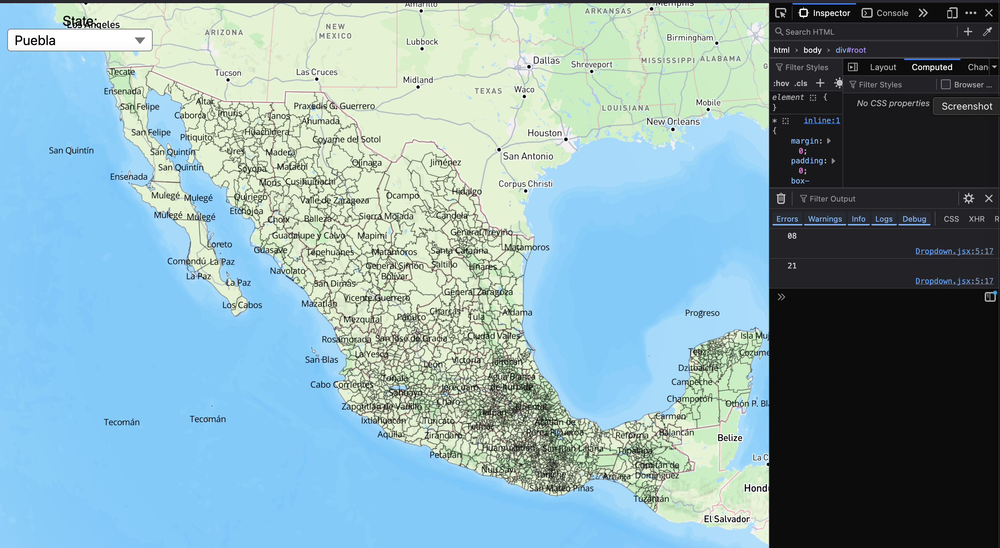

### Use the Dropdown to Set a Filter

We are ready to use the dropdown to filter content in the map layers. The Dropdown component already sets the value of the `selectedState`, and since the handler function is defined in the dropdown's parent, `App`, it can be passed down to any of `App`'s children, including `Map`. We just need to pass the change down to the Map component, so it can re-render in response to the user action.

`App.jsx`:
```jsx
<Map selectedState={selectedState} />
```

Then, we receive that prop in the Map component and use it to trigger a `useEffect`.

`Map.jsx`:
```jsx
//... import statements

function Map({ selectedState }) {

//.. mapRefs and first useEffect


    useEffect(() => {
        if (!mapRef.current) return;
        if (!mapRef.current.getLayer('municipal-limits')) return;
        if (!mapRef.current.getLayer('municipal-labels')) return;

        mapRef.current.setFilter(
            'municipal-limits',
            ['==', ['get', 'cve_ent'], selectedState]
        );

        mapRef.current.setFilter(
            'municipal-labels',
            ['==', ['get', 'cve_ent'], selectedState]
        );

    }, [selectedState]);

// ... rest of Map function
}
```

This `useEffect` will run whenever the `selectedState` changes. It first checks to make sure the map exists and the layers we intend to filter exist. Then it retrieves the `cve_ent` code from the layer data and checks that it matches the value of the selected option. It will filter out anything that does not equal that value. This follows [Mapbox data expression syntax](https://docs.mapbox.com/style-spec/reference/expressions/), which can be used for layer filter properties, as well as for many paint and layout properties.

### Centering on the Selected State

Now we are going to ensure that the map centers on the user's selected state each time the selection changes. We're going to use Python to generate the data we need from a geojson file we already have.

Earlier, we generated a file with the municipal boundaries, which we called `muni-limits.json`, and which currently resides in our `src/data` directory. Now, we will load that file into geopandas, group the data by state instead of municipality, and create a dictionary with the maximum and minimum coordinates for each state. Then we'll output the result as a new JSON file. Be sure that the resulting file is in your `scr/data` directory.

```python
import geopandas as gpd
import json

municipios = gpd.read_file('muni-limits.json')

estados = municipios.dissolve(by="cve_ent")

bounds_dict = {}

for state_code, row in estados.iterrows():
    minx, miny, maxx, maxy = row.geometry.bounds
    bounds_dict[state_code] = [
        [minx, miny],
        [maxx, maxy]
    ]

with open("state-bounds.json", "w", encoding="utf-8") as f:
    json.dump(bounds_dict, f, indent=2)
```

Back in the Map component, import the data: `import state_bounds from '../data/state-bounds.json';`. Then we will add a few lines to the same `useEffect` hook that sets the filters:

`Map.jsx`:
```jsx
        const bounds = state_bounds[selectedState];

        if (!bounds) return;

        mapRef.current.fitBounds(bounds, {
            padding: 30,
            duration: 1500
        });
```

With this little change, the map will zoom to the selected state every time the selection changes.

Here is the complete JSX code so far:

`App.jsx`:
```jsx
import { useState } from "react";
import Map from "./components/Map";
import './css/App.css';
import states from './data/mex-states.json';
import Dropdown from "./components/Dropdown";

function App(){
    const [selectedState, setSelectedState] = useState("");

    const handleChange = (e) => {
        console.log(e.target.value);
        setSelectedState(e.target.value);
    }

    return <div id="page-wrapper">
       <Dropdown
           options={states}
           id="state"
           selectedValue={selectedState}
           onChange={handleChange}
       />
       <Map selectedState={selectedState} />
    </div>
}

export default App;
```

`Dropdown.jsx`:
```jsx
import '../css/Dropdown.css';

function Dropdown( {options, id, selectedValue, onChange }){
    return <div className='select-and-label'>
        <label htmlFor={id}>{id.charAt(0).toUpperCase() + id.slice(1)}:</label>
        <select
            className='dropdown' id={id}
            onChange={onChange}
            value={selectedValue}
        >
            {
                options.map(option => (
                        <option
                            value={option.code}
                            key={option.code}
                        >
                            {option.name}
                        </option>
                    ))
            }
        </select>
    </div>

}

export default Dropdown;
```

`Map.jsx`:
```jsx
import { useEffect, useRef} from "react";
import mapboxgl from 'mapbox-gl';
import 'mapbox-gl/dist/mapbox-gl.css';
import '../css/Map.css';
import municipios from '../data/muni-limits.json';
import state_bounds from '../data/state-bounds.json';

function Map({ selectedState }){
    const mapRef = useRef(null);
    const mapContainerRef = useRef(null);

    useEffect(() => {
        mapboxgl.accessToken = import.meta.env.VITE_MAPBOX_TOKEN;
        mapRef.current = new mapboxgl.Map({
            container: mapContainerRef.current,
            center: [-103.7294, 23.8002],
            zoom: 4.23,
            style: 'mapbox://styles/mapbox/standard'
        });

        mapRef.current.on('load', () => {
           mapRef.current.addSource('municipios', {
               type: 'geojson',
               data: municipios
           });

            mapRef.current.addLayer({
                id: 'municipal-limits',
                type: 'line',
                source: 'municipios',
                paint: {
                    "line-width": 0.1,
                }
            });

            mapRef.current.addLayer({
                id: 'municipal-labels',
                type: 'symbol',
                source: 'municipios',
                layout: {
                    "text-field": ['get', 'nomgeo'],
                    "text-size": 10.5
                }
            });
        });

        return () => {
            mapRef.current.remove()
        }
    }, [])


    useEffect(() => {
        if (!mapRef.current) return;
        if (!mapRef.current.getLayer('municipal-limits')) return;
        if (!mapRef.current.getLayer('municipal-labels')) return;

        mapRef.current.setFilter(
            'municipal-limits',
            ['==', ['get', 'cve_ent'], selectedState]
        );

        mapRef.current.setFilter(
            'municipal-labels',
            ['==', ['get', 'cve_ent'], selectedState]
        );

        const bounds = state_bounds[selectedState];

        if (!bounds) return;

        mapRef.current.fitBounds(bounds, {
            padding: 30,
            duration: 1500
        });

    }, [selectedState]);

    return <div id="map-container" ref={mapContainerRef}></div>
}

export default Map;
```

## Create Population Choropleths

With the basic map functionality in place, we're ready to add some data and use the map to display it. We'll show the top ten Indigenous groups by population in each state, and display the population of each group by municipality, with a color code to show the variation in population across municipalities.

## Get and Shape the Data

We'll get the data from the [website of the former Mexican Council for Humanities, Sciences, and Technology](https://cultura.conahcyt.mx/pueblosindigenas/) (CONAHCYT). The Council has since been folded into a new agency called SECIHTI, the Secreatariat for Science, Humanities, Technology, and Innovation, but the older CONAHCYT website is still available.

On the page linked above, near the top, there is a map called "Pueblos indígenas y su contexto", with a blue button labeled "Descargar datos". Clicking on that link will download the source data for the map, a file called `pueblos_indigenas_contexto.zip`. When the file is unzipped, we will see three folders: one for layers, one for tables, and one for metadata. We'll use the layer file called `pciaf_pob_indigena_residentes_20_loc_p.geojson`.

We're going to go back to our Python notebook for a while. It may be helpful to start a new notebook so we don't have stale variables hanging around. Our first task will be to load the new JSON file. We'll also need data from our existing `muni-limits.json` file. In this example, the source file for Indigenous population has been renamed to have a `.json` file ending.

```python
import geopandas as gpd

gdf = gpd.read_file('pciaf_pob_indigena_residentes_20_loc_p.json')
municipios = gpd.read_file('muni-limits.json')
```

In the source data, Indigenous population is broken down by *localidad*, which is one step smaller than *municipio*. Our first step will be to use geopandas to group the data by municipio instead of localidad, so we can find the total population by municipio.

```python
df = (
    gdf
    .groupby(
        ["cve_ent", "cve_mun", "nom_mun", "clave_pueblo", "nombre_pueblo"],
        as_index=False
    )["pihogares"]
    .sum()
)
```

We're going to visualize the population of each Indigenous group by showing colors with different opacities, with the darker representing higher populations, and lighter showing lower populations. As our baseline for 100% opacity, we'll select the municipio in each state that has the highest population of any given group. Other opacities will be represented as percentages of that baseline. To do this, we need to find the municipio with the highest population of each group in each state.

```python
group_max = (
    df
    .groupby(["cve_ent", "clave_pueblo"], as_index=False)["pihogares"]
    .max()
    .rename(columns={"pihogares": "group_max"})
)
```

We'll then merge that data back into our main data frame.

```python
df = df.merge(
    group_max,
    on=["cve_ent", "clave_pueblo"],
    how="left"
)
```

Now we can calculate the percentage for each Indigenous group in each municipio. This will be the number that controls the opacity in our choropleths.

```python
df["pct_max"] = (
    df["pihogares"] / df["group_max"] * 100
)
```

Finally, we'll create a new JSON file that has the Indigenous population data merged with our GeoJSON file of municipal boundaries. We could also merge it back into our existing municipal limits file, but in this case we'll create a new file.

```python
merged = municipios.merge(
    df,
    on=["cve_ent", "cve_mun"],
    how="left"
)

merged.to_file('mex-indig-pop.json', driver="GeoJSON")
```

We'll make sure this file is in our project's `src/data` directory.

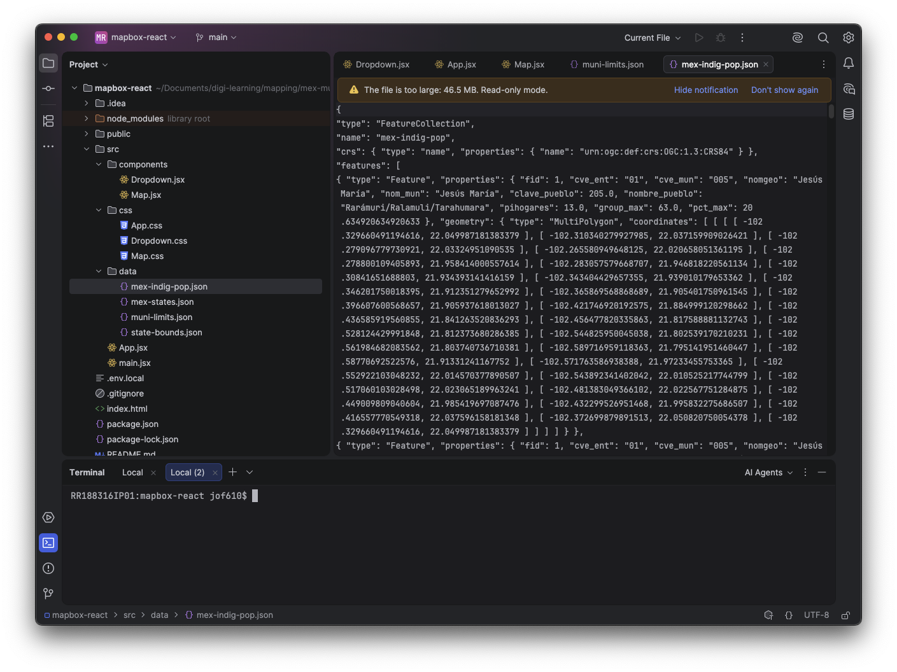

For this project, we'll only show ten Indigenous groups for each state. For each state, we'll calculate the ten groups with the highest population in that state. First we'll create a data frame with the totals for each group.

```python
group_totals = (
    gdf
    .groupby(["cve_ent", "clave_pueblo", "nombre_pueblo"], as_index=False)["pihogares"]
    .sum()
)
```

To make it easier to shape the data the way we want, we'll drop the default data frame index. This will force the first column, which is the municipal code, to be the index.

```python
group_totals = group_totals.reset_index(drop=True)
```

Now we'll create a Python dictionary with each state's ten Indigenous groups with the highest population. We're going to force the municipio codes to be strings, since this is how they are currently formated in our application. The result will be a JSON-compatible data structure that JavaScript can read as an object.

```python
top_ten_per_state = {}

for idx, group in group_totals.groupby("cve_ent"):
    top10 = (
        group
        .sort_values("pihogares", ascending=False)
        .head(10)
        .reset_index(drop=True)
    )
         
    top_ten_per_state[idx] = [
        {
            "code": str(row["clave_pueblo"]),
            "name": row["nombre_pueblo"]
        }
        for i, row in top10.iterrows()
    ]
```

This data structure should look this:

```json
{'01': [{'code': '211', 'name': 'Náhuatl'},
  {'code': '502', 'name': 'Jñatrjo/Mazahua'},
  {'code': '513', 'name': 'Binnizá/Zapoteco'},
  {'code': '501', 'name': 'Otomí'},
  {'code': '516', 'name': 'Na savi/Ñuu Saavi/Mixteco'},
  {'code': '602', 'name': 'Mayaʾwiinik/Maya'},
  {'code': '210', 'name': 'Wixárika/Huichol'},
  {'code': '701', 'name': 'Totonaco'},
  {'code': '801', 'name': 'Purépecha/Pʾurhépecha/Pʾurhé/Tarasco'},
  {'code': '901', 'name': 'Ayuuk/Ayook/Mixe'}],
  // ...
```

We can now export the data structure as a JSON file:

```python
import json

with open("state-groups.json", "w", encoding="utf-8") as f:
    json.dump(top_ten_per_state, f, ensure_ascii=False, indent=2)
```

Ensure that the resulting file is in our data directory.

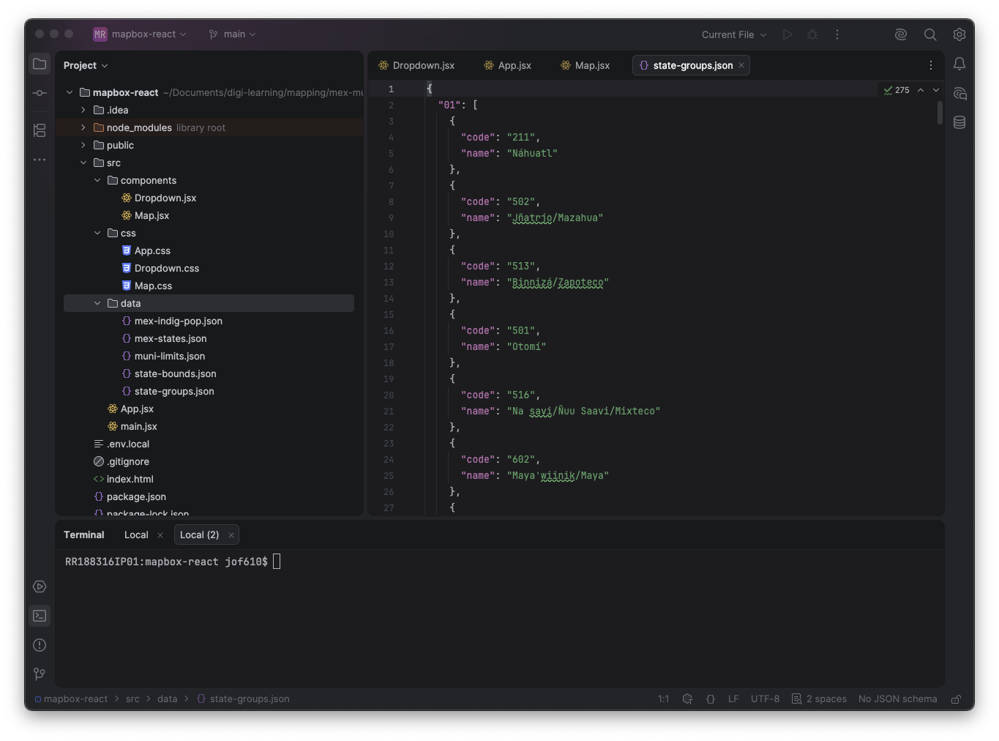

### Showing the Second Dropdown

Now, every time the user selects a state, we want to show a second dropdown offering a selection of Indigenous groups. Eventually, the map will change its display depending on the group selected. For now, let's get the dropdown showing correctly.

We'll start by importing the data that we'll use to generate our dropdown. At the top, with all the other import statements, we'll add: `import groupsByState from './data/state-groups.json';`. This will bring in our JSON as a variable called `groupsByState`.

Then we'll set up a piece of state to track the groups that are currently selected. These consist of groups for a given state, so we can call it `stateGroups`. Our initial state will be an empty array: `const [stateGroups, setStateGroups] = useState([]);`.

Now, every time a new state is selected, we need to change the groups that are selected. This means we need a `useEffect` that will be triggered every time the `selectedState` piece of state changes. We'll start by importing `useEffect`, since we are not currently using it in our `App.jsx`: `import { useState, useEffect } from "react";`.

Now we can write our `useEffect`:

```jsx
useEffect(() => {
        const groups = groupsByState[selectedState] || [];
       
         const newGroups = groups.map((group, i) => ({
            ...group,
            active: i === 0
        }));
        
        setStateGroups(newGroups);
        }, [selectedState]);
```

We know that `selectedState` is a Mexican geographic code representing a state, and that it is a string. In our `state-groups.json` file, we used the corresponding codes as the keys for each list. So we can retrieve the list of groups corresponding to our selected state with `const groups = groupsByState[selectedState] || [];`, leaving an empty array as the failsafe in case the code is an error and does not retrieve anything.

Then, we loop over the groups in the appropriate list. The only change we make is to add an `active` property. Initially, we set its value to the expression `i === 0`, which means for the first element in the list it will be set to true, and for all the rest, it will be set to false. Later, this will change when the user makes selections from the dropdown, and we will use the `active: true` property to decide what data to display on the map.

Finally, we set the `stateGroups` piece of state to the new value. We set this hook to run every time a new state is selected.

In our `handleChange` event handler, we can now remove the console log, which no longer serves any purpose.

Now we can add a second instance of our Dropdown component. We're going to need to arrange them together, so we'll wrap them in a div.

```jsx
<div id="dropdowns">
    <Dropdown
        options={states}
        id="state"
        selectedValue={selectedState}
        onChange={handleChange}
    />
    <Dropdown
    />
</div>
```

Our second dropdown should only show up after the user has selected a state, so we'll make its visibility dependent on a truthy value for `selectedState`.

```jsx
 {selectedState && <Dropdown
               
           />}
```

Now we can fill in the second dropdown's props. Its options will be the list of groups corresponding to the selected state, which we've put into the `stateGroups` piece of state. For an id, we'll put down "group".

```jsx
{selectedState && <Dropdown
                options={stateGroups}
                id="group"
           />}
```

For the value, we'll search through our `stateGroups` piece of state for the group with the `active: true` property set, using an empty string as the fallback in case none is found.

```jsx
{selectedState && <Dropdown
                options={stateGroups}
                id='group'
                selectedValue={stateGroups.find(group => group.active)?.code || ""}
           />}
```

For the `onChange` prop, we'll create a new handler:

```jsx
const handleGroupChange = e => {
        const code = e.target.value;
        setStateGroups(prev => prev.map(group => ({
            ...group,
            active: group.code === code
        })));
    }
```

Here, we're using React's built-in `prev` variable to grab the previous list, that is, the currently selected list. Then we go through the list and change which group has the `active: true` property, then return the new list.

We can now pass that handler to our second Dropdown component:

```jsx
{selectedState && <Dropdown
                options={stateGroups}
                id='group'
                selectedValue={stateGroups.find(group => group.active)?.code || ""}
                onChange={handleGroupChange}
           />}
```

With all this done, the second dropdown will appear when a state is selected, and it will be populated with the correct list of groups.

Here is the current state of our `App.jsx` file:

`App.jsx`:
```jsx
import { useState, useEffect } from "react";
import Map from "./components/Map";
import './css/App.css';
import states from './data/mex-states.json';
import Dropdown from "./components/Dropdown";
import groupsByState from './data/state-groups.json';

function App(){
    const [selectedState, setSelectedState] = useState("");
    const [stateGroups, setStateGroups] = useState([]);

    useEffect(() => {
        const groups = groupsByState[selectedState] || [];

         const newGroups = groups.map((group, i) => ({
            ...group,
            active: i === 0
        }));

        setStateGroups(newGroups);
        }, [selectedState]);


    const handleChange = (e) => {
        setSelectedState(e.target.value);
    }

    const handleGroupChange = e => {
        const code = e.target.value;
        setStateGroups(prev => prev.map(group => ({
            ...group,
            active: group.code === code
        })));
    }

    return <div id="page-wrapper">
       <div id="dropdowns">
           <Dropdown
               options={states}
               id="state"
               selectedValue={selectedState}
               onChange={handleChange}
           />
           {selectedState && <Dropdown
                options={stateGroups}
                id='group'
                selectedValue={stateGroups.find(group => group.active)?.code || ""}
                onChange={handleGroupChange}
           />}
       </div>
       <Map selectedState={selectedState} />
    </div>
}

export default App;
```

We now have a presentation problem. The absolute positioning style that we applied to our first dropdown is now causing both dropdowns to appear in the same place. We need to revise the style sheets a bit to display the dropdowns properly.

### Revise Dropdown Styles

We're going to target the `#dropdowns` div that we created earlier. We'll take the absolute positioning, which we had applied to the individual Dropdown component, and we'll move it instead to this wrapper div. That way, the dropdowns will stop overlapping.

`App.css`:
```css
#dropdowns {
    position: absolute;
    top: 0.7rem;
    left: 0.7rem;
    padding: 0.2rem;
    display: flex;
    flex-flow: column nowrap;
    gap: 0.7rem;
}
```

We're also making this wrapper element a flex parent and directing its children to appear in column layout with a gap of 0.7 rem between them.

Next we'll add a wrapper to our `select` elements to help us position our custom dropdown arrows. Right now, that arrow's position is tied to the `select-and-label` div that wraps the `label` and `select` elements. The problem is, now both `select-and-label` divs will be flex children of the `#dropdowns` div. This will make them take up the same width. But the dropdowns themselves will have the width of their widest options. This means the two dropdowns will have different widths. But the arrows are pinned to the wrapper, not the dropdown, so they will both occupy the same horizontal position. One of them will be inside its dropdown, the other one will appear hang out wide to the right. To avoid this, we'll tie the arrow to this new wrapper div.

`Dropdown.jsx`:
```jsx
<div className='select-wrapper'>
    //... <select> element here
</div>
```

With this in place, we can revise our `Dropdown.css`.

First, remove the absolute positioning from the `.select-and-label` class, since we've moved this over to the `#dropdowns` element in the App component. We can also add a `gap` property to better customize the distance between the label and the dropdown.

`Dropdown.css`:
```css
.select-and-label {
    display: flex;
    flex-flow: column nowrap;
    align-items: center;
    gap: 0.2rem;
    z-index: 1;
    font-family: Helvetica, "Helvetica Neue", sans-serif;
    --select-border: #777;
}
```

With this change, the two dropdowns should be visible instead of overlapping. But the dropdown arrow is incorrectly positioned. We'll give the `select-wrapper` class relative positioning, so the pseudo-element will be positioned absolutely in relation to its wrapper.
css
```
.select-wrapper {
    position: relative;
}
```

Finally, we move the pseudo-element out of the `select-and-label` class and onto the `select-wrapper` class, and alter its position rules:

```css
.select-wrapper::after {
    content: "";
    position: absolute;
    right: 0.75rem;
    top: 50%;
    transform: translateY(-50%);
    width: 0.8em;
    height: 0.5em;
    background-color: var(--select-border);
    clip-path: polygon(100% 0%, 0 0%, 50% 100%);
    pointer-events: none;
}
```

The dropdowns are now appearing correctly, and their custom arrows are correctly positioned.

We can also make a little adjustment to the labels, since they can sometimes be hard to see when they overlap map labels. We can give them a light background.

```css
label {
    padding: 0.2rem 0.7rem;
    border: none;
    border-radius: 0.5rem;
    background-color: #f9f9f9b3;
}
```

We're finally ready to receive the user's group selection and display the corresponding population data on the map.

### Display the Choropleths

The first thing we need to do is pass the `stateGroups` piece of state to the Map component.

`App.jsx`:
```jsx
<Map selectedState={selectedState} groupList={stateGroups} />
```

Remember, at any given moment the list of groups has ten groups, and at any given state, the list has one marked `active`.

In the Map component, we can receive the prop and retrieve the currently active group. We can create a console log to verify that it's working correctly.

`Map.jsx`:
```jsx
function Map({ selectedState, groupList }){
    const mapRef = useRef(null);
    const mapContainerRef = useRef(null);

    const activeGroup = groupList.find(group => group.active);

    console.log(activeGroup);
    //.. rest of Map component
```

Now, we can see the currently selected group in the console whenever a new state is selected or a new group is selected. It should be an object that contains the group's code and name, as well as an `active: true` property.

Our next step is to retrieve the data and add it as a source in our map whenever the map loads. We can add this import statement: `import pop_data from '../data/mex-indig-pop.json';`. Then, inside the `mapRef.current.on('load', () => {` function, we can add another data source:

```jsx
mapRef.current.addSource('population', {
              type: 'geojson',
              data: pop_data 
           });
```

We're ready to add a layer that displays the population data with color codes. But we'll need to add a list of colors to use. We can define an array of colors in the App component, but outside (above) the App function:

```jsx
const COLORS = [
    "#8B4513", "#2E8B57", "#4169E1", "#D2691E",
    "#8A2BE2", "#B22222", "#20B2AA", "#CD853F",
    "#556B2F", "#FF8C00"
];
```

In our `useEffect` hook, where we create the "groups" state, we can add a color property to each group.

```jsx
const newGroups = groups.map((group, i) => ({
            ...group,
            color: COLORS[i], 
            active: i === 0
        }));
```

We will now see a color code displayed with each console log, for example:

```js
{
  "code": "507",
  "name": "Chinanteco",
  "color": "#8A2BE2",
  "active": true
}
```

We can now add a layer. We have previously seen line and symbol layers. Now we'll add a third type of layer, the fill layer. There are many other [types of layers](https://docs.mapbox.com/style-spec/reference/layers/#type) including raster layers, circle layers, hillshade layers, heatmap layers, and various others.

Remember, each type of layer has its own set of sub-properties. There are two sub-properties that determine the way layer data is rendered: the layout and paint properties. Each type of layer has specific sub-properties to their layout and paint properties. A [fill layer](https://docs.mapbox.com/style-spec/reference/layers/#fill) renders polygons with custom paint properties.

The fill layer paint properties that interest us here are `fill-color` and `fill-opacity`. We will be using specific fill colors with different opacities. The [fill-opacity property](https://docs.mapbox.com/style-spec/reference/layers/#paint-fill-fill-opacity) accepts an [interpolate expression](https://docs.mapbox.com/style-spec/reference/expressions/#interpolate). 

Interpolations can be 
- linear
- exponential (with specified bases) 
- cubic bezier 

Here we are using a slightly exponential interpolation to create gradations between specified stop points based on the `pct_max` valueσ we created earlier for each Indigenous population in each municipio.

On map load, we'll have a transparent fill color since there is no active group selected yet. If we didn't have any selection at all, the default would be all-black fill for every municipio. We'll set fill opacity in a different `useEffect` hook when the user selects a state or a group from the dropdown.

```jsx
mapRef.current.addLayer({
    id: "population",
    type: "fill",
    source: "population",
    paint: {
        "fill-color": "rgba(255, 0, 0, 0)",
    }
});
```

In order to respond to the user's choices of states and groups, we create another `useEffect` hook that triggers when either the `selectedState` or the `groupList` are modified.

```jsx
useEffect(()=>{
        if (!mapRef.current) return;
        if (!activeGroup || !selectedState) return;
        if (!mapRef.current.getLayer('population')) return;

        mapRef.current.setFilter('population', [
            "all",
            ["==", ["get", "cve_ent"], selectedState],
            ["==", ["get", "clave_pueblo"], Number(activeGroup.code)]
        ]);

        mapRef.current.setPaintProperty(
            "population",
            "fill-color",
            activeGroup.color
        );
    
        mapRef.current.setPaintProperty(
                "population",
                "fill-opacity",
                [
                    "interpolate",
                    ["exponential", 1.2],
                    ["coalesce", ["get", "pct_max"], 0],
                    0, 0,
                    1, 0.2,
                    20, 0.35,
                    40, 0.5,
                    60, 0.65,
                    80, 0.8,
                    100, 0.95]
            );
    }, [selectedState, groupList])
```

We first include the usual failsafes so that the hook does has no effect unless the required variables or layers are not present.

Next, we filter the population layer to match the user's selected state and groups.

Finally, we customize the layer's paint property. We change its color to match the color set for that group when we created the layer configuration objects (in the `groupList` piece of state). Then we add an opacity property with an interpolation expression based on the pct_max property.

We now have choropleths showing the population of each Indigenous group in each municipio, in relation to the municipio in that state that has the largest population of that specific group.

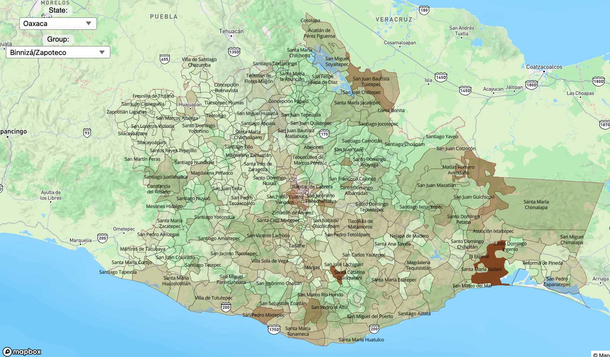

## Informational Popups

Our final component will be a popup that shows the actual population numbers when the user hovers or clicks on a municipio.

### Set Up the Event Handlers

First, let's use the console to investigate what kind of information we could get when the user interacts with our population layer polygons. Let's set up an event handler in our Map component. We can also do some cleanup: we don't need `console.log(activeGroup)` any more. We'll delete that, and in its place put our handler:

```jsx
const handlePolygonClick = e => {
        console.log(e);
    }
```

At the bottom of the `mapRef.current.on('load', () => {}` function, we'll add the click handler on our population layer, right after creating the layer itself: `mapRef.current.on('click', 'population', handlePolygonClick);`. Now, when we activate the population layer by selecting a state, then click on any municipio, we should see the event object displayed in the console.

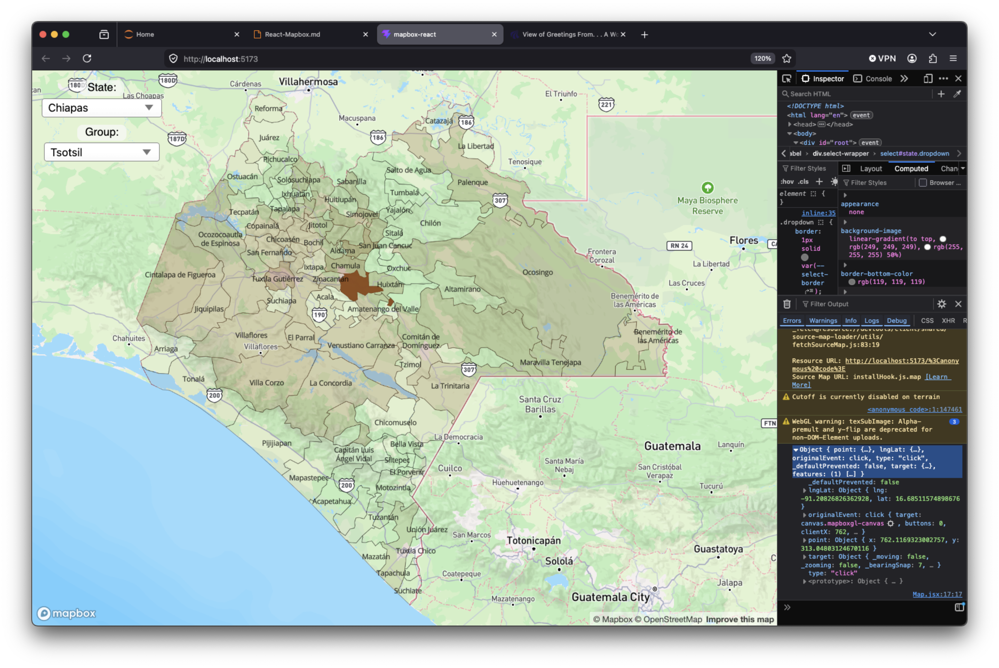

We can see that the event object has a `lngLat` property. This looks like an object with two properties representing the location the user clicked on. There is also a `features` property, which is an array with one element. Let's inspect that.

```jsx
const handlePolygonClick = e => {
        console.log(e.features[0]);
    }
```

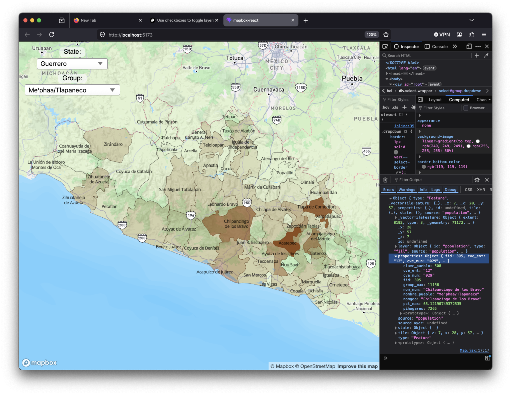

We can see that this contains information from the source GeoJSON feature, as well as information on the Mapbox layer that is rendering the data. The feature object has a properties sub-property, and that properties object has data from our source GeoJSON, including the name of the municipio, the name of the Indigenous group, and the `pihogares`, the group's population in that specific municipio.

```jsx
const handlePolygonClick = e => {
        console.log(e.features[0].properties);
    }
```

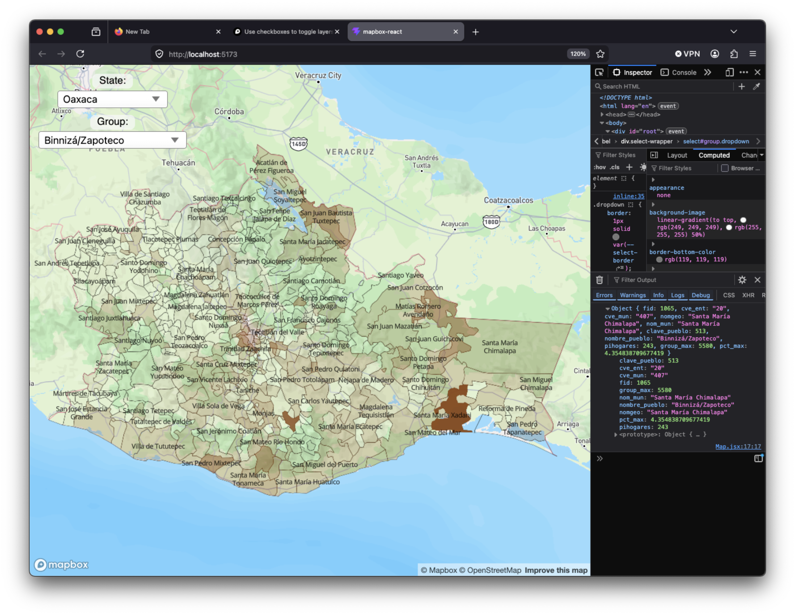

We can test the same functionality for a mouseenter event.

```jsx
const handlePolygonMouseEnter = e => {
        console.log(e.features[0].properties);
    }
```

```jsx
mapRef.current.on('mouseenter', 'population', handlePolygonMouseEnter);
```

We can do the same for mouseleave.

```jsx
const handlePolygonMouseLeave = e => {
        console.log("Mouse left!");
    }
```

```jsx
mapRef.current.on('mouseleave', 'population', handlePolygonMouseLeave);
```

We should now see appropriate console logs when the mouse enters a municipio and leaves it.

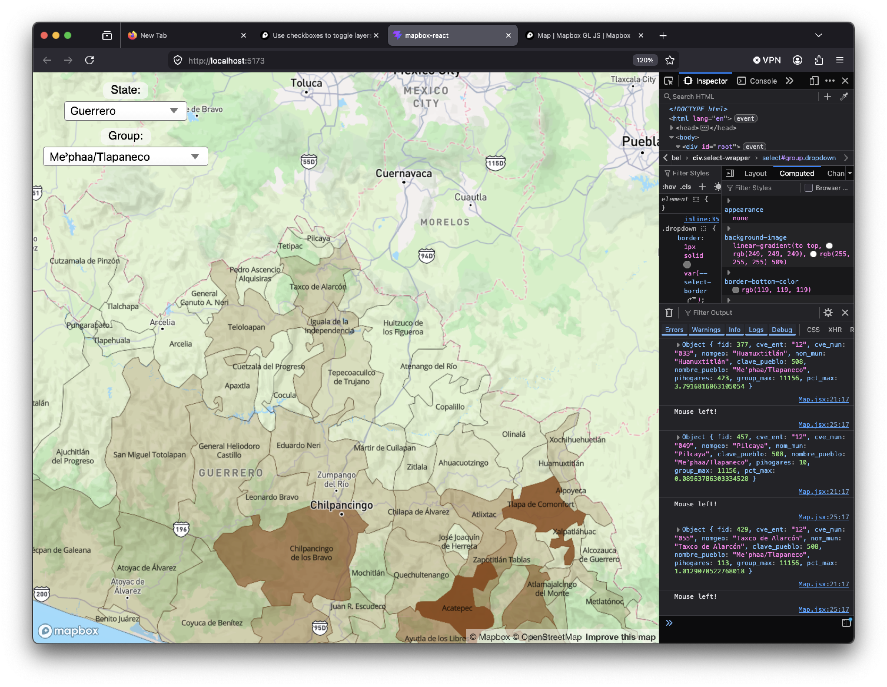

### Set Up the Popup Component

The popup will be a separate component. We will create it as a child of the Map component. So the first thing we do is create an empty Popup component.

`src/components/Popup.jsx`
```jsx
function Popup(){
    return (
        <div>
            Hola!
        </div>
    )
}

export default Popup;
```

Then, we'll import it into our Map component. We'll set it as a child of our map container and pass it a reference to the map object. The import statement will be `import Popup from "./Popup";`. Then, instead of `return <div id="map-container" ref={mapContainerRef}></div>`, our JSX return will be:

`Map.jsx`:
```jsx
return <div id="map-container" ref={mapContainerRef}>
        <Popup mapRef={mapRef} />
    </div>
```

Let's add a piece of state to contain current popup data, and pass that to the Popup component. We'll need to import `useState` since we haven't used it yet in the Map component: `import { useEffect, useRef, useState } from "react";`. Then, inside the Map function: `const [popupData, setPopupData] = useState(null);`. 

Now we can modify the click handler. In addition to the feature properties, we are going to need to get the longitude and latitude of the point clicked or hovered on. Without a specified coordinate, the popup would not appear on the map.

```jsx
const handlePolygonClick = e => {
        setPopupData({
            lngLat: e.lngLat,
            properties: e.features[0].properties
        });
    }
```

And we can pass the data to the Popup component:

```jsx
return <div id="map-container" ref={mapContainerRef}>
        <Popup mapRef={mapRef} popupData={popupData} />
    </div>
```

Now we can modify the Popup component to show an actual Popup. First we're going to need the appropriate imports. We'll need a `useEffect` to make popup show when the data changes. We'll also need `useRef` to hold references to the popup and its container. Since popups are Mapbox objects, we'll need to import the Mapbox GL JS library. And we're going to use a [ReactDOM portal](https://react.dev/reference/react-dom/createPortal) as a way to [hand control of the popup to Mapbox](https://react.dev/reference/react-dom/createPortal#rendering-react-components-into-non-react-dom-nodes), rather than controlling its location ourselves.

`Popup.jsx`:
```jsx
import {useEffect, useRef} from "react";
import {createPortal} from "react-dom";
import mapboxgl from "mapbox-gl";
```

Now we'll receive the map reference and popup data from the parent Map element. Then we'll create a reference to a new popup object. We'll also create a div to contain it (and eventually hand over to Mapbox), and create a reference to that too.

```jsx
function Popup({ popupData, mapRef }){

    const popupRef = useRef(new mapboxgl.Popup())
    const containerRef = useRef(document.createElement('div'));
    
    return (
            <div>
                Hola!
            </div>
        )
    }

export default Popup;
```

Next, we'll create our `useEffect` hook. First we'll make sure the effect does not run until there is a map reference. This will avoid any problems with asynchronous loads triggering the effect before the map reference exists. Then, we'll use object destructuring to get access to the coordinate data that we passed in from the Map component. Remember, this popup data is currently set in the click event handler.

The next step is the most critical. We use [Mapbox Popup methods](https://docs.mapbox.com/mapbox-gl-js/api/markers/#popup) to set the location of the popup on the map (`.setLngLat`), to set the popup's content (`.setDOMContent`), and then add it to the map. Using `setDOMContent` instead of `setHTML` allows us to create the content separately and just refer to it here, which is a bit cleaner, though slightly more complex, than `setHTML`.

We end with a usual `useEffect` cleanup function, and set the hook to run whenever there is a change in the map or in the popup data.

```jsx
function Popup({ popupData, mapRef }){

    const popupRef = useRef(new mapboxgl.Popup())
    const containerRef = useRef(document.createElement('div'));

    useEffect(() => {
            // wait for map to initialize
            if (!mapRef.current) return 
    
            const { lngLat } = popupData;
    
            popupRef.current
                .setLngLat(lngLat)
                .setDOMContent(containerRef.current)
                .addTo(mapRef.current)
    
            // cleanup function to remove popup on unmount
            return () => popupRef.current.remove()
    
        }, [mapRef, popupData]);
    
    return (
            <div>
                Hola!
            </div>
        )
    }

export default Popup;
```

We need to do one more thing to have the popup show on the page. In our JSX return, instead of just returning a div, we'll create a portal and return our container reference. Since we earlier set the popup content to the container reference, this will hand off the popup to Mapbox.

```jsx
return createPortal(
        <div>
            Hola!
        </div>,
        containerRef.current
    );
```

You should now see the popup whenever you click on the map.

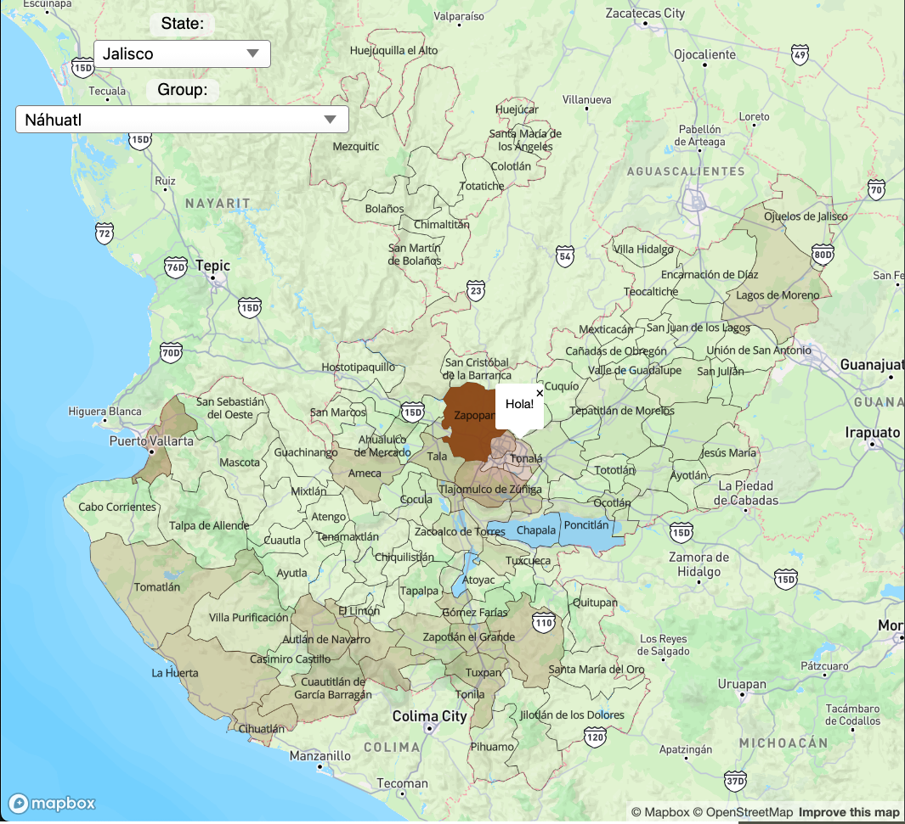

### Adding Popup Content

Now it is relatively straightforward to customize the popup content. We'll destructure the properties object and use it to populate data in the popup.

```jsx
    const { properties } = popupData;

    return createPortal(
        <div>
            <h3>Municipality:</h3>
            <p>{properties.nom_mun}</p>
            <h3>People:</h3>
            <p>{properties.nombre_pueblo}</p>
            <h3>Population:</h3>
            <p>{properties.pihogares}</p>
        </div>,
        containerRef.current
    );
```

It's also best practice to add some defensive measures that will protect against errors in case there are problems with the popup data. In the `useEffect`, just under the `if (!mapRef.current) return`:

```jsx
 if (!popupData) {
            popupRef.current.remove();
            return;
        }
```

And outside the `useEffect`, just above the properties object destructure: `if (!popupData) return null`.

### Setting up the Mousemove Popup

We'll finish our project by setting the popup to follow the user's mouse movements. To do this, we'll replace the earlier mouseenter event with a mousemove event.

`Map.jsx`:
```jsx
 const handlePolygonMouseMove = e => {
        setPopupData({
            lngLat: e.lngLat,
            properties: e.features[0].properties
        });
    }

  const handlePolygonMouseLeave = e => {
        setPopupData(null);
    } 

   useEffect(() => {
       //...useEffect contents
       mapRef.current.on('click', 'population', handlePolygonClick);
       mapRef.current.on('mousemove', 'population', handlePolygonMouseMove);
       mapRef.current.on('mouseleave', 'population', handlePolygonMouseLeave);
```

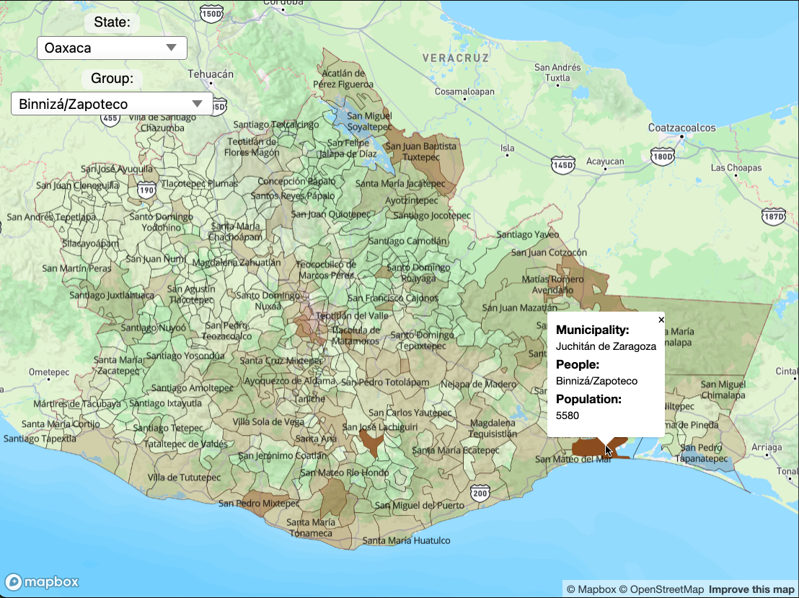

This will work well, but we can make one last improvement, moving the cleanup function to its own `useEffect`. Otherwise, the popup vanishes and reappears every time the user moves the mouse, which creates a subtle flicker effect.

`Popup.jsx`:
```jsx
useEffect(() => {
        if (!mapRef.current) return // wait for map to initialize

        if (!popupData) {
            popupRef.current.remove()
            return
        }

        const { lngLat } = popupData;

        popupRef.current
            .setLngLat(lngLat)
            .setDOMContent(containerRef.current)
            .addTo(mapRef.current)

    }, [mapRef, popupData]);

    useEffect(() => {
        return () => popupRef.current.remove();
    }, []);
```
## Add an Informational Modal

The application currently has no information for the user on what it is or how to approach it. We could add a header, a sidebar, or an accordion section. A common approach is a modal that loads when the user first visits the application, and that is the technique we will apply.

We'll be revisiting the ReactDOM portal technique we used for the popups. Our modal will have absolute positioning to make it occupy the entire screen. This will work only if it has no positioned ancestors, otherwise its absolute position will be relative to its closest positioned ancestor. To avoid this, we are going to use a portal to remove it from what would otherwise be its position in the React hierarchy.

Let's first create our Modal component.

`components/Modal.jsx`:
```jsx
function Modal () {
  return (
          <div className='modalWrapper'>
            <div className='modalContent'>
              I'm a modal!
            </div>
          </div>
  )
}

export default Modal;
```

Here we are creating a modal wrapper div, which will be the hazy background covering the whole page. The modal wrapper contains a modal content div, which contains the actual readable content. The key to making this work is the style sheet. Let's work on that next.

`css/Modal.css`:
```css
.modalWrapper {
    position: absolute;
    top: 0;
    right: 0;
    width: 100%;
    height: 100%;
    min-height: 100dvh;
    
    display: flex;
    flex-flow: column nowrap;
    align-items: center;
    justify-content: center;
    
    background-color: rgba(241, 238, 235, 0.8);
    z-index: 4;
}

.modalContent {
    background-color: #f9f9f9;
    width: auto;
    height: auto;
    padding: 1.5rem 3rem;
    max-width: 90%;
    z-index: 4;
    font-family: "Helvetica Neue", Helvetica, Arial, sans-serif;
}
```

Here we
- Use absolute positioning for the modal background. 
- This removes the modal from the typical flow of HTML content. 
- The modal is positioned at the top right corner.
- The modal is spread out over 100% of the width and height of the page.
- We use flex positioning to make the modal content a flex child.
- We use justify-content and align-items to place the content in the center of the viewport. 
- We give it a grayish background color with an opacity of 80%.
- We use z-index to make sure it appears to overlay the map content and popups.

For the modal content:
- We use width and height `auto` to make the white background adjust to the content
- We use padding to ensure some space around the content
- We give it a `max-width` of 90% so the content never completely covers the modal background.

Now let's be sure to add the import statement for the CSS at the top of the Modal component:

`Modal.jsx`:
```jsx
import '../css/Modal.css';
```

We can now import the modal into our App component and make it appear on the page. At the top of our App component, with the other imports, we can add: `import Modal from "./components/Modal";`. Then we can make the Modal appear:

`App.jsx`:
```jsx
function App(){
 // ... useEffects etc.
  return <div id="page-wrapper">
    {/*-- ... dropdown stuff */}
    <Map selectedState={selectedState} groupList={stateGroups} />
    <Modal />
  </div>
}
```

We should now see the modal when the content re-renders. It's not very functional yet, though. It should appear when the page first loads, then disappear if the user clicks anywhere on the page. In React, when we think of content changing depending on user actions, we should think of using the state system. So let's introduce a piece of state to control when the modal appears and disappears.

`App.jsx`:
```jsx
// ... imports and color constant

function App(){
  const [selectedState, setSelectedState] = useState("");
  const [stateGroups, setStateGroups] = useState([]);
  const [showModal, setShowModal] = useState(true);

 // ... useEffect and other event handlers

  const handleModalClick = () => {
    setShowModal(false);
  }

  return <div id="page-wrapper">
    {/* Dropdown and Map components */}
    {showModal && <Modal onClick={handleModalClick} />}
  </div>
}

export default App;
```

Here, we are first introducing a `showModal` piece of state. We set it to `true` when the App component first renders, because we want the modal to show automatically whenever the page is visited. Then we create a handler to manage when a user clicks anywhere on the modal. It will set the `showModal` state to false.

We wrap the Modal component in a `{showModal && ...}` expression. This means if `showModal` is true, the Modal will appear, but if it is false the expression will short-circuit and the modal won't render. 

Finally, we pass the handler down to the modal component as a prop called `onClick`.

Now, we'll pass the handler down to the modal component and set the modal wrapper div's `onClick` property to that handler.

`Modal.jsx`:
```jsx
function Modal ( {onClick} ) {
  return (
          <div 
                  onClick={onClick} 
                  className='modalWrapper'
          >
            <div className='modalContent'>
              I'm a modal!
            </div>
          </div>
  )
}
```

The modal now disappears when we click anywhere on the page.

Although the basic functionality is there, it still only works accidentally, because the modal just happens not to have any positioned HTML ancestors. But if we ever introduce such an element, the modal won't work properly. So we'll use ReactDOM portal to future-proof our modal against that possibility. First, we'll go to our `index.html` page to insert a modal container div as a direct child of the `body` element.

`index.html`:
```html
<body>
    <div id="root"></div>
    <div id="modal-container"></div>
    <script type="module" src="/src/main.jsx"></script>
</body>
```

Now we can return a portal instead of regular JSX in our Modal component:

`Modal.jsx`:
```jsx
import '../css/Modal.css';
import ReactDOM from "react-dom";

function Modal ( {onClick} ) {
    return ReactDOM.createPortal(
        <div
            onClick={onClick}
            className='modalWrapper'
        >
            <div className='modalContent'>
                I'm a modal!
            </div>
        </div>,
        document.querySelector('#modal-container')
    )
}

export default Modal;
```

We'll see no effect on the modal's behavior, but now the modal is being rendered in the `modal-container` div directly on the `index.html` page. It is removed from its position in the React component hierarchy. This means if we ever do change the hierarchy and add a `position` property to any element that is an ancestor of the modal component, the modal will still work propertly.

We are now ready to add some helpful content and a few more style rules to handle it.

`Modal.jsx`:
```html
 <div className='modalContent'>
  <h2>Mexican Indigenous Population Explorer</h2>
  <ul>
    <li>Select a Mexican state from the dropdown</li>
    <li>The map will zoom in to that state</li>
    <li>A second dropdown will list the top ten Indigenous people by population in that state</li>
    <li>Select a group to see a choropleth with the relative population in each municipality</li>
    <li>Hover over a municipality to see the population statistic for that place</li>
  </ul>
  <button>OK</button>
</div>
```

`Modal.css`:
```css
.modalWrapper {
    position: absolute;
    top: 0;
    right: 0;
    width: 100%;
    height: 100%;
    min-height: 100dvh;

    display: flex;
    flex-flow: column nowrap;
    align-items: center;
    justify-content: center;

    background-color: rgba(241, 238, 235, 0.8);
    z-index: 4;
}

.modalContent {
    background-color: #f9f9f9;
    width: auto;
    height: auto;
    padding: 1.5rem 3rem;
    max-width: 90%;
    z-index: 4;
    font-family: "Helvetica Neue", Helvetica, Arial, sans-serif;

    border-radius: 8px;
    display: flex;
    flex-flow: column nowrap;
    align-items: center;
    justify-content: center;
    gap: 1rem;
    overflow: scroll;
}

.modalContent ul {
    display: flex;
    flex-direction: column;
    justify-content: center;
    gap: 0.7rem;
}

.modalContent button {
    padding: 0.5rem 1rem;
    background-color: #4aac4a;
    color: white;
    cursor: pointer;
    border: 1px solid green;
    border-radius: 0.6rem;
}
```

The button doesn't really do anything, but it's good UX in case the user is confused about how to make the modal disappear.

## A Final Detail

One irritating detail is that the population layer loads when the app first loads, and even before the user has selected a state, the user can hover over municipios and see data with no clear context. We can disable that by breaking out of the hover handler if there is no selected state yet.

`Map.jsx`:
```jsx
const handlePolygonMouseMove = e => {
  if (!selectedState) return;

  setPopupData({
    lngLat: e.lngLat,
    properties: e.features[0].properties
  });
}
```

Unfortunately, we run into a subtle little React issue here. The handlers are defined in the component, but they are instantiated and attached to the map in the `useEffect`, at this point:

```jsx
 mapRef.current.on('mousemove', 'population', handlePolygonMouseMove);
mapRef.current.on('mouseleave', 'population', handlePolygonMouseLeave);
```

That `useEffect` runs once, when the map first renders. At that time, the value of `selectedState` is an empty string. This means that from the event handler's perspective, `selectedState` is always an empty string, even when it's updated in the app. This in turn means the popups will now never appear.

`useRef` to the rescue.

`Map.jsx`:
```jsx
function Map({ selectedState, groupList }) {
    const mapRef = useRef(null);
    const mapContainerRef = useRef(null);
    const selectedStateRef = useRef(selectedState);

    useEffect(() => {
        selectedStateRef.current = selectedState;
    }, [selectedState]);

    const [popupData, setPopupData] = useState(null);

    const activeGroup = groupList.find(group => group.active);

    const handlePolygonClick = e => {
        setPopupData({
            lngLat: e.lngLat,
            properties: e.features[0].properties
        });
    }

    const handlePolygonMouseMove = e => {
        if (!selectedStateRef.current) return;
        setPopupData({
            lngLat: e.lngLat,
            properties: e.features[0].properties
        });
    }
// ... rest of component
}
```

Here we set a reference to the selected state. Then we define a `useEffect` that updates the reference every time `selectedState` changes. Now, in the event handler, we look at the reference, and not directly at the value of `selectedState` itself. The reference is just a pointer to the value, so now instead of locking in on a single value, it locks in on the reference, which will update every time the value changes. Now the popup is blocked on first load, but appears whenever there is a selected state.


We could develop this much further, of course. We could refine the popup appearance, modify the appearance when the map first loads, test the mobile UX, improve the data pre-processing, refine the interpolation that generates the color curve, explore other ways to generate a choropleth, and many othe improvements. But that's good for now!

This project demonstrated how to create a React app, how to bring in a Mapbox map, how to add data to the map, how to use layers to visualize the data, and how to add popups to display data.


